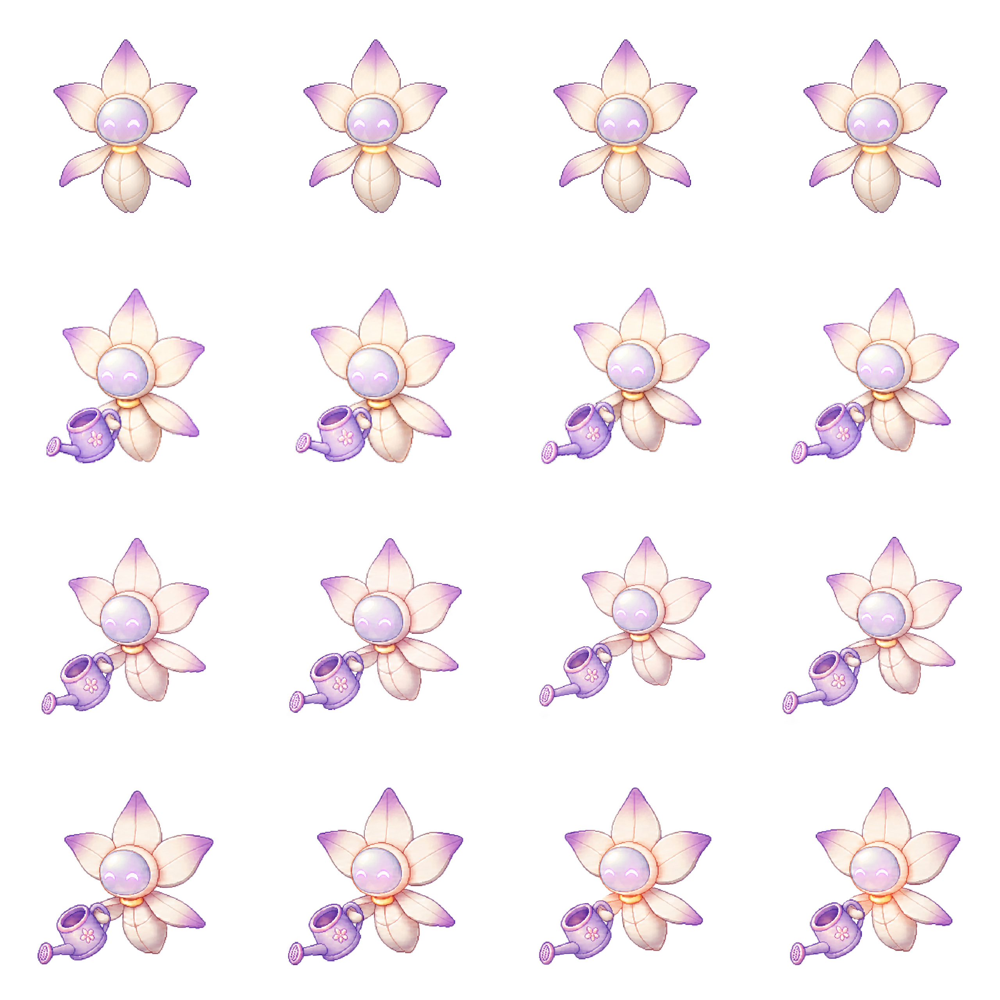
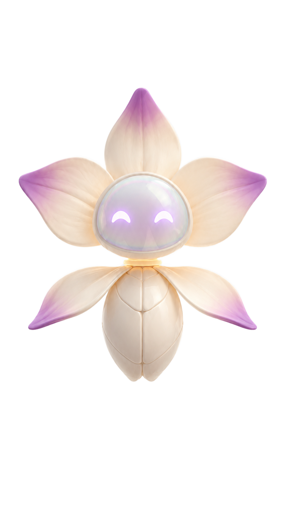
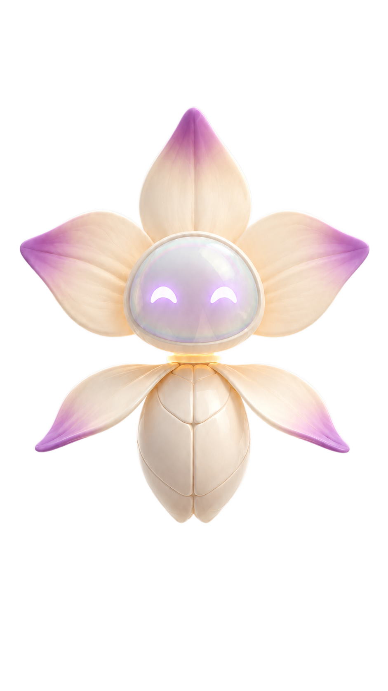
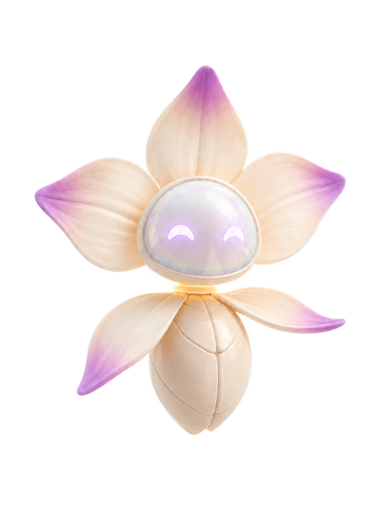
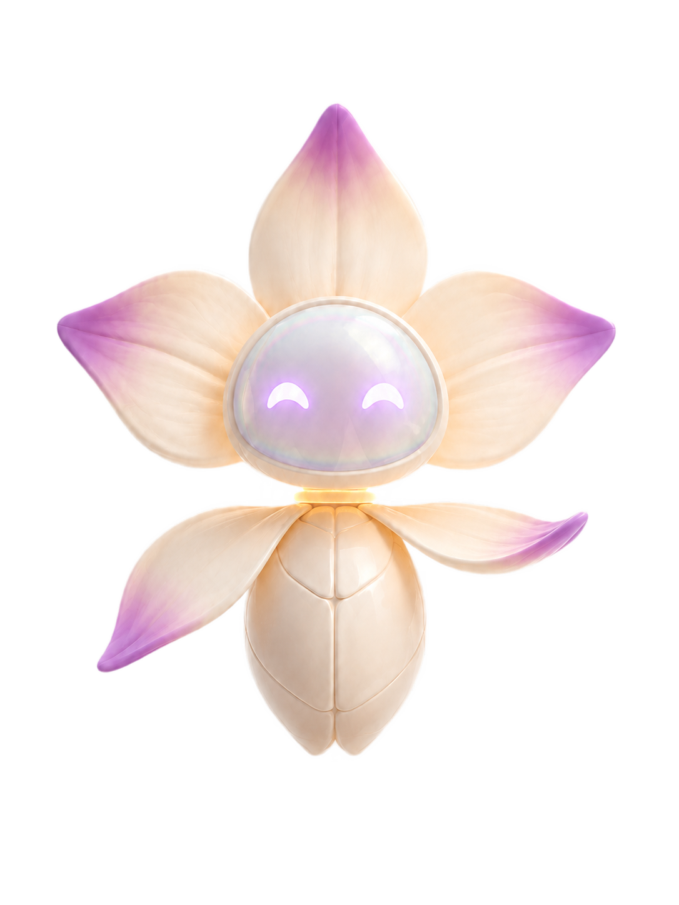
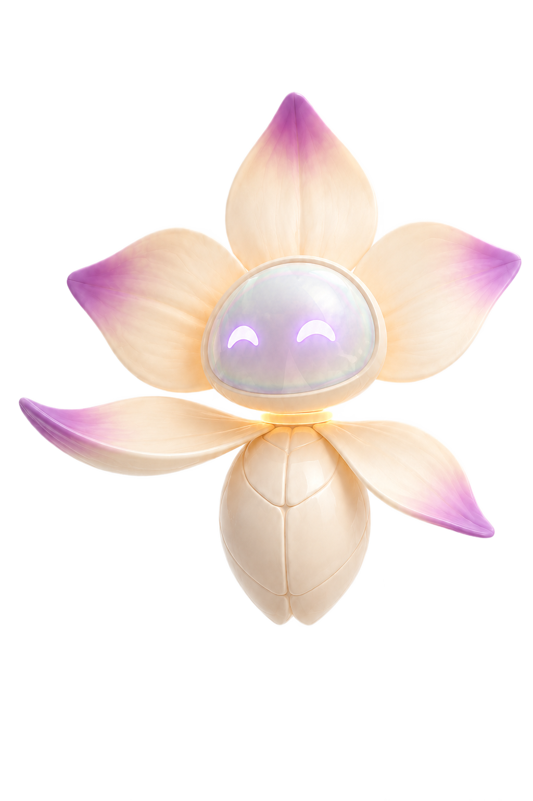
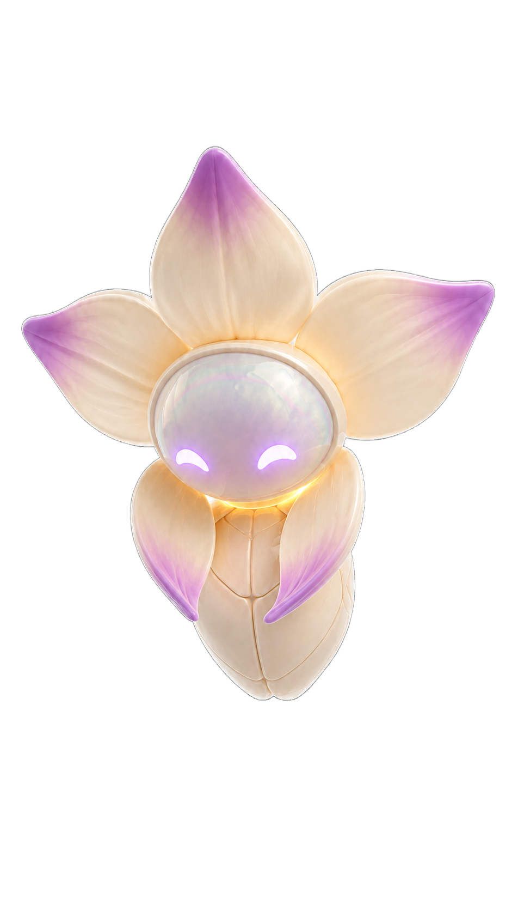

# GVO - Contact sheet de Lia para Mundo I
## Ticket 004D-8C

## 0. Estado

`004D-8C_CONTACT_SHEET_DOCUMENTAL / SIN_RUNTIME / SIN_ASSETS_NUEVOS`

Esta contact sheet documenta visualmente los assets existentes de Lia para decidir la base de Mundo I: Raiz. No crea microposes, no modifica `/estacion/1`, no cambia imports, no toca runtime y no reexporta imagenes.

Version visual HTML local:

- `docs/gvo/lia/review-boards/LIA_MUNDO_I_CONTACT_SHEET_004D8C.html`

## 1. Resumen

La biblioteca central de Lia creada en 004D-8A contiene 31 assets current-used copiados sin modificar bytes:

| Grupo | Cantidad | Funcion en esta revision |
| --- | ---: | --- |
| Carga Inicial | 1 | Referencia de timing y motion |
| Portada / Intro - referencia canonica | 1 | Identidad visual base |
| Portada / Intro - poses | 5 | Pose, gesto y direccion visual |
| Portada / Intro - rig por capas | 16 | Microvida, blink, collar, petalos y sombra |
| Transicion entre mundos | 8 | Escala compacta, fallback y sprites breves |
| Mundo I: Raiz - carpeta futura | 0 | Preparada, sin microposes generadas |

## 2. Carga Inicial

| Asset | Imagen | Ruta en biblioteca | Utilidad para Mundo I | Clasificacion | Nota |
| --- | --- | --- | --- | --- | --- |
| `lia_loading_16f.png` |  | `public/assets/gvo/shared/lia/current-used/carga-inicial/lia_loading_16f.png` | timing / aparicion / registro de frames | `APTO_REFERENCIA_MOTION` | No usar como identidad principal: su gesto esta atado al riego de carga inicial. |

## 3. Portada / Intro - referencia canonica

| Asset | Imagen | Ruta en biblioteca | Utilidad para Mundo I | Clasificacion | Nota |
| --- | --- | --- | --- | --- | --- |
| `lia_master_cover_reference_v1.png` |  | `public/assets/gvo/shared/lia/current-used/portada-intro/lia_master_cover_reference_v1.png` | identidad canonica | `APTO_BASE_MUNDO_I`, `APTO_REFERENCIA_IDENTIDAD` | Base principal recomendada para conservar silueta, cabeza opalescente, petalos, collar ambar y presencia calmada. |

## 4. Portada / Intro - poses

| Asset | Imagen | Ruta en biblioteca | Utilidad para Mundo I | Clasificacion | Nota |
| --- | --- | --- | --- | --- | --- |
| `lia_pose_idle_v1.png` |  | `public/assets/gvo/shared/lia/current-used/portada-intro/lia_pose_idle_v1.png` | pose base junto a planta/raiz | `APTO_REFERENCIA_POSE`, `APTO_REFERENCIA_IDENTIDAD` | Buena base para `lia_root_idle`. |
| `lia_pose_greeting_v1.png` |  | `public/assets/gvo/shared/lia/current-used/portada-intro/lia_pose_greeting_v1.png` | invitacion calma | `APTO_REFERENCIA_POSE` | Referencia posible para `lia_root_invite_relation`. |
| `lia_pose_explain_calm_v1.png` |  | `public/assets/gvo/shared/lia/current-used/portada-intro/lia_pose_explain_calm_v1.png` | dialogo y explicacion | `APTO_REFERENCIA_POSE` | Referencia para explicaciones de RELACION, PERCEPCION y MEDIACION. |
| `lia_pose_point_portal_1_v1.png` |  | `public/assets/gvo/shared/lia/current-used/portada-intro/lia_pose_point_portal_1_v1.png` | senalamiento / guia | `APTO_REFERENCIA_POSE` | Referencia de gesto, no runtime directo de raiz. |
| `lia_pose_activate_portal_1_v1.png` |  | `public/assets/gvo/shared/lia/current-used/portada-intro/lia_pose_activate_portal_1_v1.png` | energia / activacion | `APTO_REFERENCIA_POSE`, `APTO_FALLBACK` | Util como intencion visual, pero puede asociarse demasiado a portal. |

## 5. Portada / Intro - rig por capas

| Subgrupo | Assets | Ruta base | Utilidad para Mundo I | Clasificacion | Nota |
| --- | --- | --- | --- | --- | --- |
| Sombra | `lia_rig_shadow_soft_v1.png` | `public/assets/gvo/shared/lia/current-used/portada-intro/` | apoyo de aparicion/materializacion | `APTO_REFERENCIA_MOTION` | Util para teletransporte sutil sin pop duro. |
| Cuerpo / bulbo | `lia_rig_body_bulb_segmented_v1.png` | `public/assets/gvo/shared/lia/current-used/portada-intro/` | base de rig | `APTO_BASE_MUNDO_I` | Mantener cuerpo no humano y segmentado. |
| Petalos | `lia_rig_petal_left_lower_v1.png`, `lia_rig_petal_right_lower_v1.png`, `lia_rig_petal_left_upper_v1.png`, `lia_rig_petal_right_upper_v1.png`, `lia_rig_petal_top_v1.png` | `public/assets/gvo/shared/lia/current-used/portada-intro/` | microvida por capas | `APTO_REFERENCIA_MOTION` | Conservar 5 petalos principales y no exagerar gestos. |
| Collar / glow | `lia_rig_collar_amber_v1.png`, `lia_rig_glow_collar_v1.png` | `public/assets/gvo/shared/lia/current-used/portada-intro/` | pulso, foco y teletransporte | `APTO_REFERENCIA_MOTION`, `APTO_REFERENCIA_IDENTIDAD` | El collar ambar debe seguir siendo senal identitaria. |
| Cabeza | `lia_rig_head_opal_clean_v1.png` | `public/assets/gvo/shared/lia/current-used/portada-intro/` | identidad canonica | `APTO_REFERENCIA_IDENTIDAD` | No agregar boca, nariz, cejas ni rasgos humanos. |
| Ojos | `lia_rig_eyes_crescent_neutral_v1.png`, `lia_rig_eyes_crescent_blink_25_v1.png`, `lia_rig_eyes_crescent_blink_50_v1.png`, `lia_rig_eyes_crescent_closed_v1.png`, `lia_rig_eyes_crescent_happy_v1.png`, `lia_rig_eyes_crescent_attentive_v1.png` | `public/assets/gvo/shared/lia/current-used/portada-intro/` | blink / atencion / serenidad | `APTO_REFERENCIA_MOTION` | Ojos media luna, expresivos pero discretos. |

## 6. Transicion entre mundos

| Asset | Imagen | Ruta en biblioteca | Utilidad para Mundo I | Clasificacion | Nota |
| --- | --- | --- | --- | --- | --- |
| `lia_transition_root_master_v1.png` |  | `public/assets/gvo/shared/lia/current-used/transition-world/lia_transition_root_master_v1.png` | escala compacta | `APTO_REFERENCIA_ESCALA`, `APTO_FALLBACK` | Util como fallback pequeno si el detalle no es critico. |
| `lia_transition_root_master_v1.webp` |  | `public/assets/gvo/shared/lia/current-used/transition-world/lia_transition_root_master_v1.webp` | escala compacta | `APTO_REFERENCIA_ESCALA`, `APTO_FALLBACK` | Equivalente WebP. |
| `lia_transition_root_idle_4f_v1.png` |  | `public/assets/gvo/shared/lia/current-used/transition-world/lia_transition_root_idle_4f_v1.png` | sprite breve idle | `APTO_REFERENCIA_MOTION`, `APTO_REFERENCIA_ESCALA` | Referencia de economia de movimiento. |
| `lia_transition_root_idle_4f_v1.webp` |  | `public/assets/gvo/shared/lia/current-used/transition-world/lia_transition_root_idle_4f_v1.webp` | sprite breve idle | `APTO_REFERENCIA_MOTION`, `APTO_REFERENCIA_ESCALA` | Equivalente WebP. |
| `lia_transition_root_guide_2f_v1.png` |  | `public/assets/gvo/shared/lia/current-used/transition-world/lia_transition_root_guide_2f_v1.png` | gesto de guia compacto | `APTO_REFERENCIA_POSE`, `APTO_REFERENCIA_MOTION` | Bueno como referencia, insuficiente como set principal. |
| `lia_transition_root_guide_2f_v1.webp` |  | `public/assets/gvo/shared/lia/current-used/transition-world/lia_transition_root_guide_2f_v1.webp` | gesto de guia compacto | `APTO_REFERENCIA_POSE`, `APTO_REFERENCIA_MOTION` | Equivalente WebP. |
| `lia_transition_root_exit_v1.png` |  | `public/assets/gvo/shared/lia/current-used/transition-world/lia_transition_root_exit_v1.png` | salida / fallback | `APTO_REFERENCIA_MOTION`, `APTO_FALLBACK` | Referencia para salida o desmaterializacion. |
| `lia_transition_root_exit_v1.webp` |  | `public/assets/gvo/shared/lia/current-used/transition-world/lia_transition_root_exit_v1.webp` | salida / fallback | `APTO_REFERENCIA_MOTION`, `APTO_FALLBACK` | Equivalente WebP. |

## 7. Mundo I: Raiz - carpeta futura

| Carpeta | Estado | Clasificacion | Nota |
| --- | --- | --- | --- |
| `public/assets/gvo/shared/lia/future/mundo-i-raiz/` | Solo `.gitkeep` | Pendiente | No existen microposes ni estados aprobados de Lia para Mundo I. |

## 8. Notas de revision

- Base visual recomendada: `lia_master_cover_reference_v1.png` + rig idle por capas de Portada / Intro.
- Referencia de motion compacta: assets de Transicion entre mundos.
- Referencia de timing y registro de frames: `lia_loading_16f.png`.
- No usar Carga Inicial como identidad principal de Mundo I.
- No usar Transicion como unica base si se pierde detalle expresivo.
- No generar nuevas microposes hasta que el usuario apruebe la seleccion visual.

## 9. Confirmacion de alcance

- `/estacion/1` no se modifica.
- Runtime no se modifica.
- Imports no se modifican.
- No se generan nuevos assets artisticos.
- No se agregan dependencias.
- No se usan CDN, URLs externas, audio ni video.
