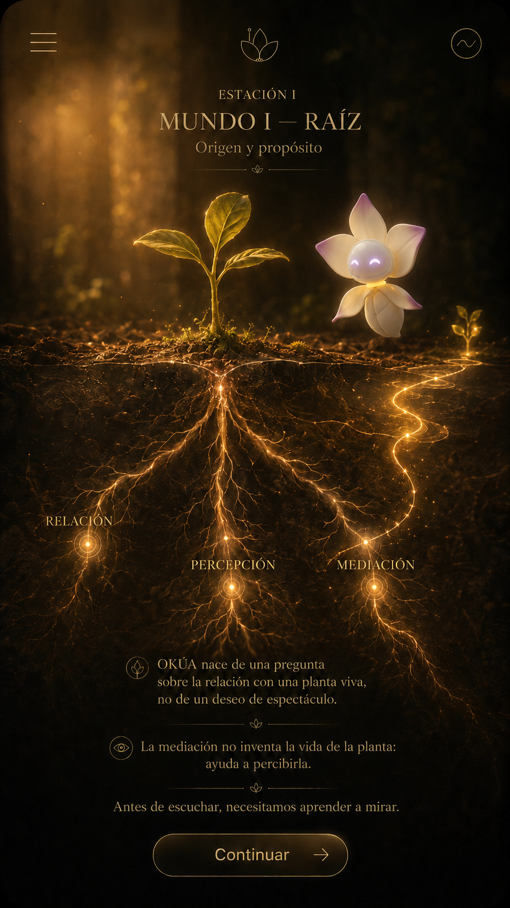
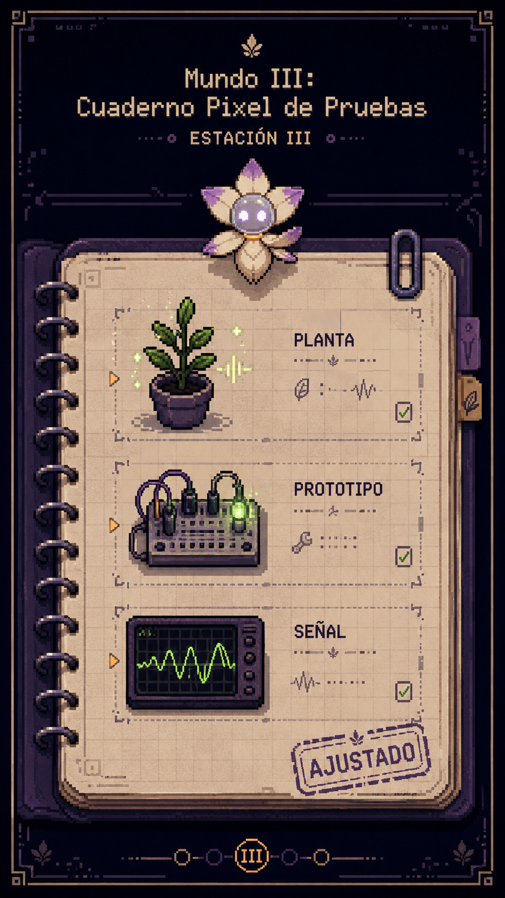

# Dossier visual de guionización GVO v1

## 1. Qué es GVO

GVO es una guía visual móvil para acompañar el recorrido OKÚA desde navegador móvil y QR físico. La experiencia se organiza como un recorrido secuencial por mundos o estaciones. Lía acompaña la lectura del Archivo Vivo y ayuda a que el visitante comprenda relaciones entre planta, señal, sistema, espacio y participación.

La experiencia debe poder entenderse sin audio. Los textos deben funcionar en pantalla móvil, con claridad para público general y sin exigir conocimiento técnico previo.

## 2. Qué es el Archivo Vivo de OKÚA

El Archivo Vivo no es un manual técnico, una audioguía convencional ni una historia infantil. Es una experiencia visual guiada para comprender cómo una planta, una señal, un sistema y un visitante se relacionan dentro de un recorrido situado.

La escritura debe ayudar a leer esa experiencia sin convertirla en clase técnica ni en fantasía literal.

## 3. Quién es Lía

Lía es la guía visual única del recorrido. Acompaña, ordena, orienta y cuida la lectura. No reemplaza a la planta y no debe convertirse en niña, mujer, hada, mascota, robot frío ni narradora omnisciente.

Esta definición no impone una voz final. Solo define la función del emisor para que la escritura mantenga coherencia.

## 4. Emisores posibles

| Emisor | Uso esperado |
| --- | --- |
| Lía | Guía, invitación, explicación breve, cierre, orientación. |
| Ambiente | Respuesta del mundo, sensación visual, activación, pausa contemplativa. |
| Sistema / interfaz | Botones, instrucciones operativas, bloqueo, reinicio, accesibilidad. |

Estos emisores organizan la escritura. No son una cárcel de estilo.

## 5. Recorrido general

| # | Pantalla / estación | Intención | Interacción | Slots | Riesgo principal |
| --- | --- | --- | --- | ---: | --- |
| 00 | Carga inicial | Preparar el recorrido sin parecer error técnico. | Sin interacción; avance automático. | 3 | Tratar la espera como falla. |
| 01 | Portada — El Archivo Vivo de OKÚA | Presentar GVO, Lía y el inicio secuencial. | Iniciar recorrido y avanzar introducción. | 13 | Prometer navegación libre antes de tiempo. |
| 02 | Transición entre mundos | Mantener continuidad entre pantallas. | Pausa automática. | 12 | Introducir contenido pedagógico nuevo. |
| 03 | Estación I — Mundo Raíz | Fundar relación, percepción y mediación. | RELACIÓN → PERCEPCIÓN → MEDIACIÓN. | 20 | Decir que la planta canta. |
| 04 | Estación II — Lía y el Pulso Invisible | Diferenciar señal bioeléctrica y experiencia mediada. | Activar seis capas en orden. | 32 | Confundir señal con música directa. |
| 05 | Estación III — Cuaderno Pixel de Pruebas | Mostrar prueba, error, prototipo y ajuste. | PLANTA → PROTOTIPO → SEÑAL → AJUSTADO. | 23 | Presentar el sistema como perfecto desde el inicio. |
| 06 | Estación IV — Mesa de Sistema | Explicar la cadena técnica completa con claridad. | Activar ocho nodos en orden. | 40 | Omitir o renombrar nodos técnicos. |
| 07 | Estación V — Mapa del Presente | Situar el montaje actual en espacio real. | PLANTAS → SISTEMA → ESPACIO → VISITANTE. | 24 | Repetir toda la técnica de Mundo IV. |
| 08 | Pantalla final — Mirador Final del Jardín | Cerrar y habilitar revisión libre. | Revisar mundos, volver al inicio o reiniciar. | 30 | Introducir teoría nueva o una sexta estación. |

## 6. Público objetivo

El público incluye niños, adolescentes, adultos, adultos mayores y visitantes con distinta familiaridad técnica. Escribir para público general no significa infantilizar. Significa claridad, legibilidad móvil, orientación y precisión.

## 7. Fichas visuales por pantalla

### 00 — Carga inicial

- Intención: preparar el recorrido con calma.
- Qué ve el visitante: Lía y una planta joven en estado de espera.
- Acción: ninguna; espera automática.
- Textos necesarios: título, subtítulo y descripción accesible.
- Debe comprender: el recorrido se está preparando.
- No debe concluir: que ocurrió un error técnico.
- Cuidar: tono sereno y continuidad.
- Relación: antecede a Portada.

### 01 — Portada — El Archivo Vivo de OKÚA

- Intención: abrir el Archivo Vivo, presentar a Lía y ordenar la primera pasada.
- Qué ve el visitante: portada con portales y guía visual.
- Acción: iniciar recorrido o tocar Portal I.
- Textos necesarios: título, CTA, diálogos introductorios, bloqueos suaves, modo libre.
- Debe comprender: primero hay recorrido secuencial.
- No debe concluir: que todos los mundos están libres desde el inicio.
- Cuidar: Lía como guía única.
- Relación: viene de carga y abre Mundo I.

### 02 — Transición entre mundos

- Intención: sostener el cruce entre pantallas.
- Qué ve el visitante: portal, avance o pausa visual.
- Acción: ninguna; espera automática.
- Textos necesarios: título por destino y apoyo breve.
- Debe comprender: está pasando al siguiente mundo.
- No debe concluir: que es una pantalla pedagógica nueva.
- Cuidar: continuidad sin saturación.
- Relación: conecta estaciones.

### 03 — Estación I — Mundo Raíz

- Intención: fundar observación, relación, percepción y mediación.
- Qué ve el visitante: planta joven, raíces y tres nodos conceptuales.
- Acción: activar RELACIÓN, PERCEPCIÓN y MEDIACIÓN en orden.
- Textos necesarios: entrada, pistas, respuestas ambientales, confirmaciones, bloqueo, cierre y accesibilidad.
- Debe comprender: antes de escuchar hay que aprender a mirar y mediar.
- No debe concluir: que la planta canta literalmente.
- Cuidar: no adelantar la cadena técnica completa.
- Relación: viene de Portada/Transición y prepara Pulso invisible.

### 04 — Estación II — Lía y el Pulso Invisible

- Intención: mostrar que hay señal bioeléctrica, pero no música directa.
- Qué ve el visitante: planta, Lía y capas del proceso.
- Acción: activar PLANTA VIVA, SEÑAL, CAPTURA, ACONDICIONAMIENTO, MAPEO y RESULTADO MEDIADO.
- Textos necesarios: entrada, pistas, respuestas, confirmaciones, bloqueos, cierre y accesibilidad.
- Debe comprender: la experiencia sonora aparece por mediación.
- No debe concluir: que la señal ya es música.
- Cuidar: evitar magia literal y tecnicismo saturado.
- Relación: continúa Mundo Raíz y prepara Cuaderno Pixel.

### 05 — Estación III — Cuaderno Pixel de Pruebas

- Intención: mostrar que OKÚA nace de pruebas, límites y ajustes.
- Qué ve el visitante: cuaderno visual con bloques y sello AJUSTADO.
- Acción: revisar PLANTA, PROTOTIPO, SEÑAL y AJUSTADO.
- Textos necesarios: notas de bitácora, pistas, confirmaciones, bloqueo, cierre y accesibilidad.
- Debe comprender: probar y ajustar también construyen el sistema.
- No debe concluir: que todo funcionó perfecto desde el inicio.
- Cuidar: evitar minijuego complejo y exceso técnico.
- Relación: viene de señal mediada y prepara la cadena técnica.

### 06 — Estación IV — Mesa de Sistema

- Intención: explicar la cadena técnica completa por primera vez.
- Qué ve el visitante: mesa o flujo con ocho nodos técnicos.
- Acción: activar PLANTA, BIONOSIFICADOR, ESP32, MIDI, WI-FI/UDP, ROUTER, SISTEMA CENTRAL y SONIDO.
- Textos necesarios: orientación, tarjetas técnicas breves, confirmaciones, bloqueos, cierre y accesibilidad.
- Debe comprender: el sonido es resultado de una cadena mediada.
- No debe concluir: que la planta produce audio directamente.
- Cuidar: precisión sin manual técnico.
- Relación: viene de prueba/ajuste y prepara síntesis espacial.

### 07 — Estación V — Mapa del Presente

- Intención: aterrizar lo aprendido en el montaje actual.
- Qué ve el visitante: mapa con plantas, sistema, espacio y visitante.
- Acción: activar PLANTAS, SISTEMA, ESPACIO y VISITANTE.
- Textos necesarios: entrada, diálogos por área, confirmaciones, bloqueo, cierre y accesibilidad.
- Debe comprender: OKÚA ocurre en un lugar real con participación.
- No debe concluir: que la app está aislada del jardín.
- Cuidar: no repetir Estación IV completa.
- Relación: viene de Mesa de Sistema y prepara el Mirador final.

### 08 — Pantalla final — Mirador Final del Jardín

- Intención: cerrar, contemplar y habilitar revisión libre.
- Qué ve el visitante: mirador con accesos a mundos y acciones finales.
- Acción: revisar mundos, volver al inicio, reiniciar o leer créditos.
- Textos necesarios: título, subtítulo, mensaje final, labels, confirmaciones, ayuda, botones, créditos y accesibilidad.
- Debe comprender: completó el recorrido y puede revisar.
- No debe concluir: que aparece una sexta estación.
- Cuidar: microcopy claro para reinicio y regreso.
- Relación: cierra las cinco estaciones.

## 8. Resumen de interacciones por estación

| Pantalla / estación | Interacción esperada | Tipo de avance | Notas para escritura |
| --- | --- | --- | --- |
| Carga inicial | Sin interacción. | Automático. | Evitar sensación de falla. |
| Portada | Iniciar recorrido y presentación de Lía. | Secuencial. | No prometer libertad total antes de tiempo. |
| Transición | Sin interacción. | Automático. | No introducir teoría nueva. |
| Estación I | RELACIÓN → PERCEPCIÓN → MEDIACIÓN. | Secuencial. | Preparar mediación sin técnica completa. |
| Estación II | Capas de señal bioeléctrica en orden. | Secuencial. | Señal no es música directa. |
| Estación III | Planta, prototipo, señal, ajuste. | Secuencial. | Mostrar iteración y aprendizaje. |
| Estación IV | Cadena técnica completa de ocho nodos. | Secuencial. | Ser claro y preciso. |
| Estación V | Plantas, sistema, espacio, visitante. | Secuencial. | Sintetizar sin repetir todo. |
| Final | Revisión libre, volver o reiniciar. | Libre y crítico. | Diferenciar volver de reiniciar. |

## 9. Escribir para pantallas de espera y carga

Las esperas no son relleno. Deben sostener continuidad, evitar sensación de falla, preparar el siguiente mundo, mantener atención sin saturar y no introducir conceptos reservados para otra estación.

## 10. Cierre del dossier

La matriz es el documento operativo final. Ahí deben escribirse los textos finales, alternativas cortas y notas de duda.
