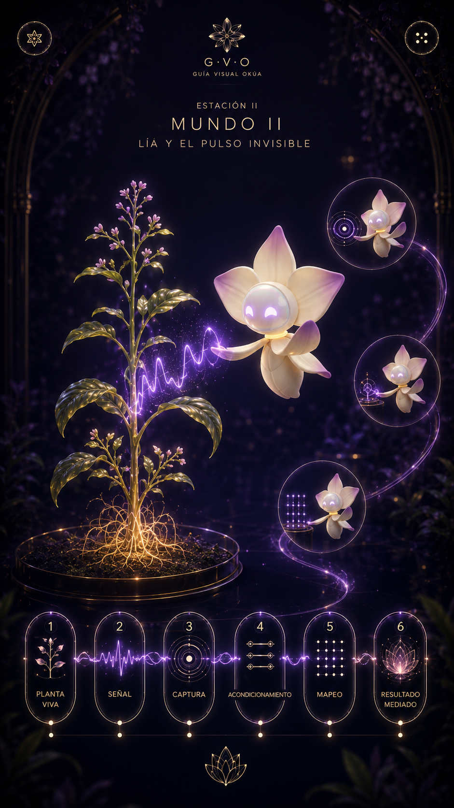

# Estación II — Mundo II: Lía y el pulso invisible

**Especificación fuente:** `../source_txt/04_estacion_ii_pulso_invisible_especificacion_v1.txt`

## Intención

Mostrar cómo una planta viva genera una señal bioeléctrica que debe ser capturada, preparada e interpretada para convertirse en una experiencia sonora mediada.

## Función dentro del recorrido

Aclarar que la señal existe, pero no equivale a música por sí sola.

## Interacción esperada

Activar seis capas en orden: Planta viva → Señal → Captura → Acondicionamiento → Mapeo → Resultado mediado.

## Modo de uso

Interactivo secuencial en primera pasada; revisión libre posterior.

## Emisor textual principal

Lía para guiar cada capa; ambiente para pulso/señal si se requiere; interfaz para bloqueo y continuar.

## Secuencia funcional sugerida

1. Entrada.
2. Seis capas activadas en orden.
3. Resultado mediado.
4. Continuar a Estación III.

## Estados de pantalla para escritura

| Estado | Qué se ve / momento | Función del texto |
| --- | --- | --- |
| w2_intro | Planta y Lía; capas inferiores apagadas | Presentar pulso invisible |
| w2_planta | Capa 1 | Planta viva |
| w2_senal | Capa 2 | Señal bioeléctrica |
| w2_captura | Capa 3 | Captura |
| w2_acondicionamiento | Capa 4 | Preparación/acondicionamiento |
| w2_mapeo | Capa 5 | Interpretación/mapeo |
| w2_resultado | Capa 6 | Resultado mediado |
| w2_complete | Capas completadas | Cerrar Mundo II |

## Textos que debe producir o revisar el escritor

- Entrada de Lía.
- Texto por capa.
- Mensaje de bloqueo suave.
- Cierre de estación.
- Botón continuar.

## Conceptos que deben quedar protegidos

- señal bioeléctrica.
- invisibilidad.
- captura.
- acondicionamiento.
- mapeo.
- resultado mediado.

## Conceptos o decisiones que deben evitarse

- planta cantante.
- música directa.
- cadena técnica completa de 8 nodos.
- magia literal.
- tecnicismo pesado.

## Nota para escritura

La pauta anterior no define el estilo final. Define qué necesita resolver cada texto dentro de la pantalla. El escritor puede modificar ritmo, voz, metáfora y construcción verbal, siempre que no se pierda la función de pantalla ni se contradigan los conceptos protegidos.
