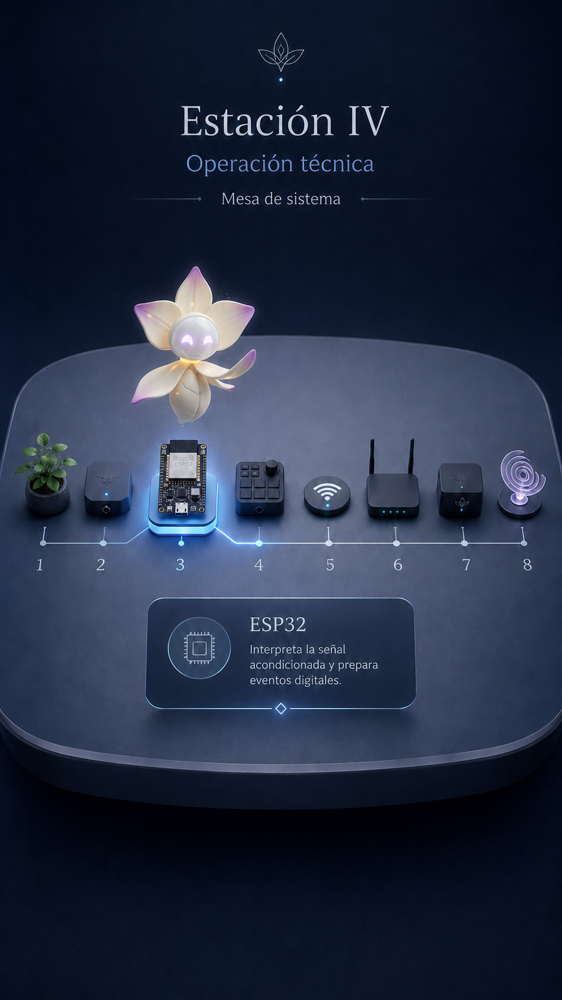

# Estación IV — Mundo IV: Mesa de Sistema

**Especificación fuente:** `../source_txt/06_estacion_iv_mesa_sistema_especificacion_v1.txt`

## Intención

Presentar la cadena técnica completa de OKÚA, mostrando cómo la señal de una planta pasa por ocho nodos de mediación hasta convertirse en un resultado sonoro organizado.

## Función dentro del recorrido

Responder cómo se conecta todo para que una señal vegetal termine en una experiencia sonora mediada.

## Interacción esperada

Activar ocho nodos en orden: Planta → Bionosificador → ESP32 → MIDI → Wi‑Fi/UDP → Router → Sistema central → Sonido.

## Modo de uso

Interactivo secuencial en primera pasada; revisión libre posterior.

## Emisor textual principal

Lía / sistema. Tarjeta técnica breve por nodo.

## Secuencia funcional sugerida

1. Entrada de mesa.
2. Activación de ocho nodos.
3. Cadena completa.
4. Continuar a Estación V.

## Estados de pantalla para escritura

| Estado | Qué se ve / momento | Función del texto |
| --- | --- | --- |
| w4_intro | Mesa y nodos apagados | Presentar cadena |
| w4_planta | Nodo 1 | Origen vivo |
| w4_bionosificador | Nodo 2 | Primer mediador/captura |
| w4_esp32 | Nodo 3 | Lectura/control |
| w4_midi | Nodo 4 | Conversión a lenguaje musical/control |
| w4_wifi_udp | Nodo 5 | Transmisión |
| w4_router | Nodo 6 | Red local |
| w4_sistema_central | Nodo 7 | Organización central |
| w4_sonido | Nodo 8 | Resultado sonoro mediado |
| w4_complete | Cadena activa | Cerrar Mundo IV |

## Textos que debe producir o revisar el escritor

- Entrada de Lía.
- Tarjeta breve por nodo.
- Mensaje de bloqueo suave.
- Cierre técnico.
- Botón continuar.

## Conceptos que deben quedar protegidos

- cadena técnica.
- mediación técnica.
- bionosificador.
- ESP32.
- MIDI.
- Wi‑Fi/UDP.
- router.
- sistema central.
- sonido.

## Conceptos o decisiones que deben evitarse

- omitir nodos.
- renombrar bionosificador como sensor genérico.
- planta que emite sonido directo.
- texto saturado.
- poetizar hasta perder precisión.

## Nota para escritura

La pauta anterior no define el estilo final. Define qué necesita resolver cada texto dentro de la pantalla. El escritor puede modificar ritmo, voz, metáfora y construcción verbal, siempre que no se pierda la función de pantalla ni se contradigan los conceptos protegidos.
