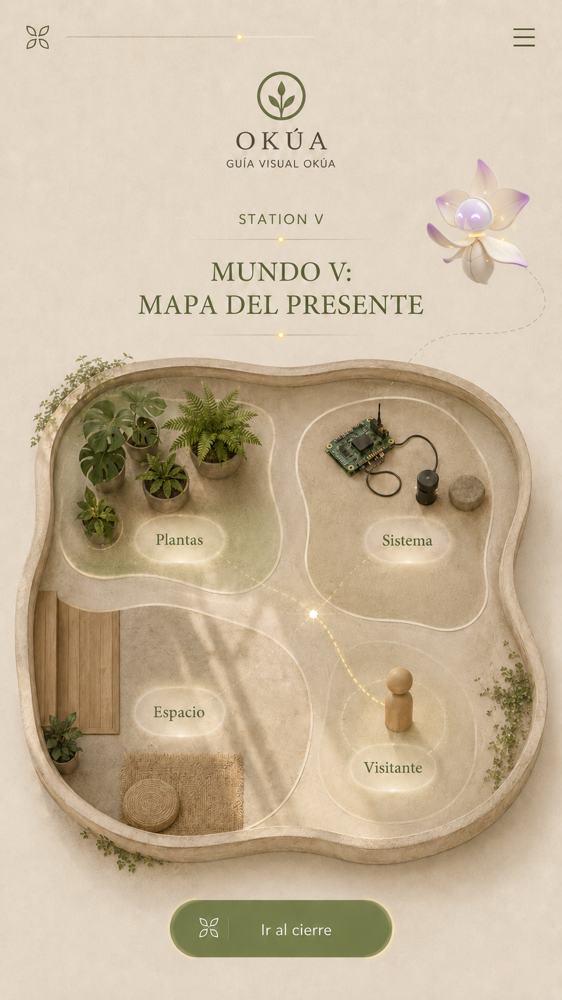

# Estación V — Mundo V: Mapa del Presente

**Especificación fuente:** `../source_txt/07_estacion_v_mapa_presente_especificacion_v1.txt`

## 1. Función de la estación dentro de GVO

Mundo V sintetiza OKÚA como montaje vivo situado. No repite la cadena técnica de Mundo IV; muestra cómo plantas, sistema, espacio y visitante integran una experiencia presente.

La ficha define función, contexto, interacción, concepto obligatorio, riesgo conceptual y longitud móvil sugerida. No impone estilo literario ni escribe diálogos finales.

## 2. Idea central para el visitante

Después de conocer la cadena, el visitante entiende OKÚA como un montaje actual donde vida vegetal, sistema, lugar y participación se encuentran.

## 3. Qué debe comprender el visitante

- OKÚA ocurre en un espacio real.
- las plantas siguen siendo parte viva del presente.
- el sistema opera como mediación y no como centro único.
- el espacio organiza la experiencia.
- el visitante participa en la lectura del montaje.
- la pantalla prepara el cierre final.

## 4. Qué no debe concluir el visitante

- que esta pantalla repite Mundo IV.
- que se introduce una estación nueva.
- que la explicación vuelve a empezar desde cero.
- que OKÚA es una idea futura y no un montaje presente.
- que el visitante es espectador pasivo.

## 5. Descripción visual para escritura

Pantalla vertical móvil con mapa o composición del montaje actual, Lía y cuatro áreas: PLANTAS, SISTEMA, ESPACIO y VISITANTE. La escritura debe sintetizar sin repetir la teoría técnica completa.

## 6. Mapa semántico de la pantalla

| Elemento visual | Qué representa para escritura | Qué no representa |
| --- | --- | --- |
| PLANTAS | Origen vivo presente | Decoración |
| SISTEMA | Mediación operando | Centro único |
| ESPACIO | Lugar real que organiza | Decorado |
| VISITANTE | Participación en la experiencia | Usuario pasivo |
| Mapa | Síntesis situada | Plano técnico exhaustivo |
| Lía | Guía de cierre parcial | Nueva narradora |

## 7. Contrato de interacción

- Primera visita: orden secuencial obligatorio `PLANTAS → SISTEMA → ESPACIO → VISITANTE`.
- Cada área correcta activa texto de síntesis.
- Tocar un área bloqueada muestra orientación suave.
- No se reexplica la cadena técnica de ocho nodos.
- Completar las cuatro áreas habilita el paso al mirador final.
- La experiencia debe entenderse sin audio.

## 8. Secuencia narrativa por estados

| Orden | Estado | Acción del visitante | Cambio visible esperado | Función narrativa |
| --- | --- | --- | --- | --- |
| 0 | `w5_intro` | Entra al mapa | Mapa y cuatro áreas visibles | Presentar síntesis |
| 1 | `w5_plantas_available` | Activa PLANTAS | Área plantas activa | Recordar origen vivo |
| 2 | `w5_sistema_available` | Activa SISTEMA | Área sistema activa | Mostrar mediación actual |
| 3 | `w5_espacio_available` | Activa ESPACIO | Área espacio activa | Aterrizar en lugar real |
| 4 | `w5_visitante_available` | Activa VISITANTE | Área visitante activa | Incluir participación |
| X | `w5_area_locked` | Toca fuera de orden | Sin avance fuerte | Orientar sin frustrar |
| 5 | `w5_complete` | Toca ir al cierre | Mapa completo | Pasar a pantalla final |

## 9. Estados de pantalla y necesidades de texto

| Estado | Qué ve / acaba de hacer | Texto requerido | Función | Evitar |
| --- | --- | --- | --- | --- |
| `w5_intro` | Escena inicial con Lía y elementos principales visibles. Ingreso a la pantalla. | Entrada (Lía) | Presentar OKÚA como montaje vivo situado. | Repetir cadena técnica |
| `w5_intro` | Escena inicial con Lía y elementos principales visibles. Ingreso a la pantalla. | Texto ambiental (Ambiente) | Situar mapa, espacio y recorrido como conjunto. | Nueva teoría |
| `w5_plantas_available` | Elemento PLANTAS disponible o activo. Visitante sigue la secuencia indicada. | Instrucción contextual (Lía) | Invitar a activar PLANTAS. | Repetir Mundo I completo |
| `w5_plantas_active` | Elemento PLANTAS disponible o activo. Visitante sigue la secuencia indicada. | Diálogo por área (Lía / ambiente) | Reconocer el origen vivo del montaje actual. | Adorno |
| `w5_plantas_active` | Elemento PLANTAS disponible o activo. Visitante sigue la secuencia indicada. | Confirmación breve (Lía) | Confirmar que el presente del montaje parte de vidas vegetales. | Planta como objeto |
| `w5_sistema_available` | Elemento SISTEMA disponible o activo. Visitante sigue la secuencia indicada. | Instrucción contextual (Lía) | Invitar a activar SISTEMA. | Reexplicar ocho nodos |
| `w5_sistema_active` | Elemento SISTEMA disponible o activo. Visitante sigue la secuencia indicada. | Diálogo por área (Lía / ambiente) | Mostrar la mediación operando en el presente. | Repetir Estación IV |
| `w5_sistema_active` | Elemento SISTEMA disponible o activo. Visitante sigue la secuencia indicada. | Confirmación breve (Lía) | Confirmar que el sistema sostiene la experiencia sin reemplazarla. | Máquina como centro único |
| `w5_espacio_available` | Elemento ESPACIO disponible o activo. Visitante sigue la secuencia indicada. | Instrucción contextual (Lía) | Invitar a activar ESPACIO. | Abstracción total |
| `w5_espacio_active` | Elemento ESPACIO disponible o activo. Visitante sigue la secuencia indicada. | Diálogo por área (Lía / ambiente) | Aterrizar la experiencia en un lugar real. | App aislada del jardín |
| `w5_espacio_active` | Elemento ESPACIO disponible o activo. Visitante sigue la secuencia indicada. | Confirmación breve (Lía) | Confirmar que el espacio también organiza la experiencia. | Decorado |
| `w5_visitante_available` | Elemento VISITANTE disponible o activo. Visitante sigue la secuencia indicada. | Instrucción contextual (Lía) | Invitar a activar VISITANTE. | Usuario pasivo |
| `w5_visitante_active` | Elemento VISITANTE disponible o activo. Visitante sigue la secuencia indicada. | Diálogo por área (Lía / ambiente) | Incluir la participación del visitante en la lectura del montaje. | Público como espectador pasivo |
| `w5_visitante_active` | Elemento VISITANTE disponible o activo. Visitante sigue la secuencia indicada. | Confirmación breve (Lía) | Confirmar que el recorrido se completa con quien lo atraviesa. | Antropocentrismo excesivo |
| `w5_area_locked` | Elemento fuera de orden no avanza. Visitante tocó un elemento bloqueado. | Bloqueo suave (Lía o sistema) | Guiar a la siguiente área. | Regaño |
| `w5_area_locked` | Elemento ya revisado recibe nuevo toque. Visitante repite un elemento completado. | Relectura / repetición (Lía o sistema) | Indicar que esa área ya fue revisada. | Error técnico |
| `w5_complete` | Pantalla completa con todos los pasos activados. Visitante completó la secuencia principal. | Cierre previo (Lía) | Preparar paso al mirador final. | Introducir estación nueva |
| `w5_complete` | Pantalla completa con todos los pasos activados. Visitante completó la secuencia principal. | Cierre ambiental (Ambiente) | Cerrar el mapa como síntesis del presente. | Repetir teoría |
| `w5_complete` | Botón de avance habilitado. Pantalla completada. | Botón (Sistema / interfaz) | Abrir transición hacia pantalla final. | Ambigüedad |
| `w5_intro` | Estado visual activo requiere descripción accesible. Fallback o lector de pantalla requiere descripción. | Descripción accesible (Sistema / accesibilidad) | Describir mapa, Lía y cuatro áreas. | Texto excesivo |
| `w5_plantas_active` | Estado visual activo requiere descripción accesible. Fallback o lector de pantalla requiere descripción. | Descripción accesible (Sistema / accesibilidad) | Describir activación de PLANTAS. | Adorno |
| `w5_sistema_active` | Estado visual activo requiere descripción accesible. Fallback o lector de pantalla requiere descripción. | Descripción accesible (Sistema / accesibilidad) | Describir activación de SISTEMA. | Ocho nodos completos |
| `w5_espacio_active` | Estado visual activo requiere descripción accesible. Fallback o lector de pantalla requiere descripción. | Descripción accesible (Sistema / accesibilidad) | Describir activación de ESPACIO. | Decorado |
| `w5_visitante_active` | Estado visual activo requiere descripción accesible. Fallback o lector de pantalla requiere descripción. | Descripción accesible (Sistema / accesibilidad) | Describir activación de VISITANTE. | Pasividad |

## 10. Slots de texto requeridos

| ID | Estado | Emisor sugerido | Tipo de texto | Función del texto | Longitud sugerida | Concepto obligatorio | Evitar |
| --- | --- | --- | --- | --- | --- | --- | --- |
| W5_INTRO_LIA_01 | `w5_intro` | Lía | Entrada | Presentar OKÚA como montaje vivo situado. | 90-160 caracteres | Presente / espacio real | Repetir cadena técnica |
| W5_INTRO_AMB_01 | `w5_intro` | Ambiente | Texto ambiental | Situar mapa, espacio y recorrido como conjunto. | 50-120 caracteres | Experiencia situada | Nueva teoría |
| W5_PLANTAS_HINT_01 | `w5_plantas_available` | Lía | Instrucción contextual | Invitar a activar PLANTAS. | 40-90 caracteres | Plantas | Repetir Mundo I completo |
| W5_PLANTAS_AMB_01 | `w5_plantas_active` | Lía / ambiente | Diálogo por área | Reconocer el origen vivo del montaje actual. | 70-140 caracteres | Plantas / vida | Adorno |
| W5_PLANTAS_CONFIRM_01 | `w5_plantas_active` | Lía | Confirmación breve | Confirmar que el presente del montaje parte de vidas vegetales. | 50-120 caracteres | Origen vivo | Planta como objeto |
| W5_SISTEMA_HINT_01 | `w5_sistema_available` | Lía | Instrucción contextual | Invitar a activar SISTEMA. | 40-90 caracteres | Sistema | Reexplicar ocho nodos |
| W5_SISTEMA_AMB_01 | `w5_sistema_active` | Lía / ambiente | Diálogo por área | Mostrar la mediación operando en el presente. | 70-140 caracteres | Sistema / mediación | Repetir Estación IV |
| W5_SISTEMA_CONFIRM_01 | `w5_sistema_active` | Lía | Confirmación breve | Confirmar que el sistema sostiene la experiencia sin reemplazarla. | 50-120 caracteres | Mediación actual | Máquina como centro único |
| W5_ESPACIO_HINT_01 | `w5_espacio_available` | Lía | Instrucción contextual | Invitar a activar ESPACIO. | 40-90 caracteres | Espacio | Abstracción total |
| W5_ESPACIO_AMB_01 | `w5_espacio_active` | Lía / ambiente | Diálogo por área | Aterrizar la experiencia en un lugar real. | 70-140 caracteres | Lugar / montaje | App aislada del jardín |
| W5_ESPACIO_CONFIRM_01 | `w5_espacio_active` | Lía | Confirmación breve | Confirmar que el espacio también organiza la experiencia. | 50-120 caracteres | Experiencia situada | Decorado |
| W5_VISITANTE_HINT_01 | `w5_visitante_available` | Lía | Instrucción contextual | Invitar a activar VISITANTE. | 40-90 caracteres | Visitante | Usuario pasivo |
| W5_VISITANTE_AMB_01 | `w5_visitante_active` | Lía / ambiente | Diálogo por área | Incluir la participación del visitante en la lectura del montaje. | 70-150 caracteres | Participación | Público como espectador pasivo |
| W5_VISITANTE_CONFIRM_01 | `w5_visitante_active` | Lía | Confirmación breve | Confirmar que el recorrido se completa con quien lo atraviesa. | 50-130 caracteres | Visitante / experiencia | Antropocentrismo excesivo |
| W5_AREA_LOCKED_01 | `w5_area_locked` | Lía o sistema | Bloqueo suave | Guiar a la siguiente área. | 35-90 caracteres | Síntesis ordenada | Regaño |
| W5_AREA_REPEAT_01 | `w5_area_locked` | Lía o sistema | Relectura / repetición | Indicar que esa área ya fue revisada. | 35-90 caracteres | Revisión cuidadosa | Error técnico |
| W5_COMPLETE_LIA_01 | `w5_complete` | Lía | Cierre previo | Preparar paso al mirador final. | 80-150 caracteres | Cierre del recorrido | Introducir estación nueva |
| W5_COMPLETE_AMB_01 | `w5_complete` | Ambiente | Cierre ambiental | Cerrar el mapa como síntesis del presente. | 50-120 caracteres | Presente / síntesis | Repetir teoría |
| W5_FINAL_BTN_01 | `w5_complete` | Sistema / interfaz | Botón | Abrir transición hacia pantalla final. | 1-4 palabras | Cierre | Ambigüedad |
| W5_ACCESSIBLE_SCENE_01 | `w5_intro` | Sistema / accesibilidad | Descripción accesible | Describir mapa, Lía y cuatro áreas. | 90-170 caracteres | Mapa / áreas | Texto excesivo |
| W5_ACCESSIBLE_PLANTAS_01 | `w5_plantas_active` | Sistema / accesibilidad | Descripción accesible | Describir activación de PLANTAS. | 70-140 caracteres | Plantas | Adorno |
| W5_ACCESSIBLE_SISTEMA_01 | `w5_sistema_active` | Sistema / accesibilidad | Descripción accesible | Describir activación de SISTEMA. | 70-140 caracteres | Sistema | Ocho nodos completos |
| W5_ACCESSIBLE_ESPACIO_01 | `w5_espacio_active` | Sistema / accesibilidad | Descripción accesible | Describir activación de ESPACIO. | 70-140 caracteres | Espacio | Decorado |
| W5_ACCESSIBLE_VISITANTE_01 | `w5_visitante_active` | Sistema / accesibilidad | Descripción accesible | Describir activación de VISITANTE. | 70-150 caracteres | Visitante | Pasividad |

## 11. Conceptos protegidos

- montaje vivo.
- presente.
- plantas.
- sistema.
- espacio real.
- visitante.
- experiencia situada.
- síntesis.

## 12. Conceptos a evitar o tratar con cuidado

- repetir Estación IV.
- introducir estación nueva.
- explicar señal bioeléctrica completa otra vez.
- presentar OKÚA como futuro.
- saturar con teoría.
- usuario pasivo.

## 13. Pautas de accesibilidad y público general

- Público mixto: niños, adolescentes, adultos y ancianos.
- Textos legibles en pantalla móvil.
- Frases breves, sin dependencia de tecnicismos innecesarios.
- Microcopy de acción claro para avances, bloqueos, repetición y cierre.
- Descripciones accesibles útiles para fallback o lector de pantalla.
- La experiencia debe entenderse sin audio.

## 14. Relación con estación anterior y siguiente

Viene de Mundo IV, donde la cadena técnica quedó ordenada. Prepara el Mirador final, que cierra el recorrido y habilita revisión libre sin agregar teoría nueva.

## 15. Checklist específico de aprobación

- [ ] La pantalla sintetiza y no repite la cadena técnica.
- [ ] Plantas, sistema, espacio y visitante quedan diferenciados.
- [ ] El presente del montaje se entiende.
- [ ] El visitante no queda como espectador pasivo.
- [ ] El cierre prepara el mirador final.
- [ ] La lectura funciona sin audio y en móvil.
- [ ] El escritor conserva libertad autoral dentro de la función de cada slot.
