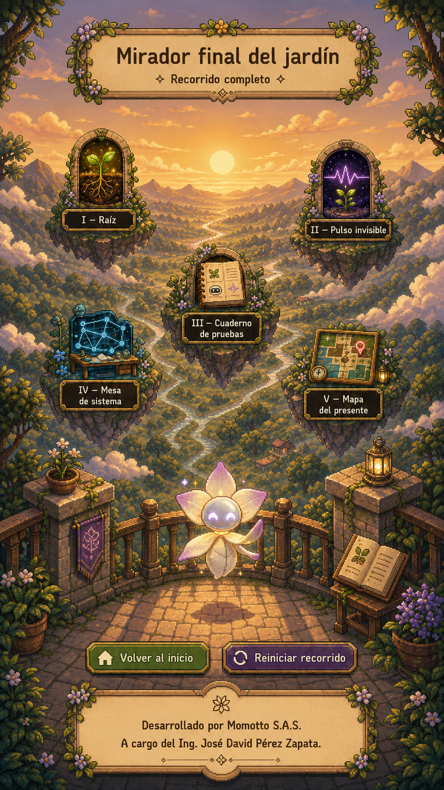

# Pantalla final — Mirador Final del Jardín

**Especificación fuente:** `../source_txt/08_pantalla_final_mirador_especificacion_v1.txt`

## Intención

Cerrar el recorrido como espacio contemplativo donde el visitante puede revisar libremente los cinco mundos, volver al inicio o reiniciar la experiencia.

## Función dentro del recorrido

Confirmar cierre, habilitar revisión libre y dar una salida clara sin introducir nuevos conceptos pedagógicos.

## Interacción esperada

Tocar accesos a los cinco mundos en modo revisión libre, volver al inicio o reiniciar recorrido.

## Modo de uso

Revisión libre / cierre navegable.

## Emisor textual principal

Lía / sistema. Interfaz para navegación y reinicio.

## Secuencia funcional sugerida

1. Entrada desde transición final.
2. Mensaje de cierre.
3. Accesos a cinco mundos.
4. Opciones Volver al inicio / Reiniciar.
5. Contemplación final.

## Estados de pantalla para escritura

| Estado | Qué se ve / momento | Función del texto |
| --- | --- | --- |
| final_intro | Mirador aparece | Cerrar recorrido |
| final_review | Accesos disponibles | Revisar libremente |
| final_return | Volver al inicio | Volver sin borrar progreso si aplica |
| final_restart | Reiniciar recorrido | Confirmar reinicio completo |

## Textos que debe producir o revisar el escritor

- Mensaje final de Lía.
- Ayuda breve.
- Labels de accesos.
- Botón Volver al inicio.
- Botón Reiniciar recorrido.
- Confirmación de reinicio.
- Créditos esenciales.

## Conceptos que deben quedar protegidos

- recorrido completo.
- revisión libre.
- mirador.
- cinco mundos.
- cierre contemplativo.

## Conceptos o decisiones que deben evitarse

- nueva estación.
- nueva teoría.
- bloquear mundos completados.
- explicación técnica nueva.
- créditos excesivos.

## Nota para escritura

La pauta anterior no define el estilo final. Define qué necesita resolver cada texto dentro de la pantalla. El escritor puede modificar ritmo, voz, metáfora y construcción verbal, siempre que no se pierda la función de pantalla ni se contradigan los conceptos protegidos.
