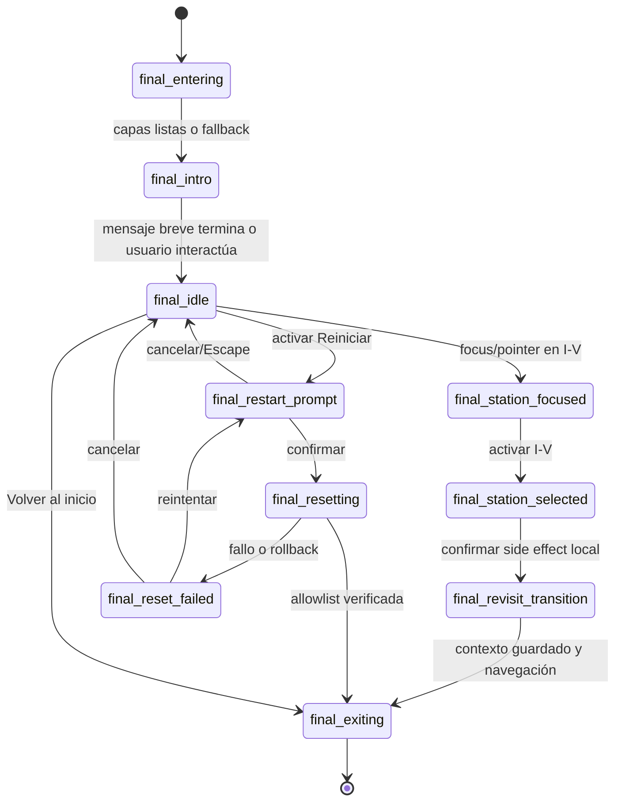

# GVO_FINAL_021B — Preproducción, blueprint e inventario maestro del Mirador

Estado: `GVO_FINAL_021B_PREPRODUCTION_COMPLETE`  
Clasificación: `PREPRODUCTION / NOT_RUNTIME / NO_IMPLEMENTATION / NO_FINAL_ART`  
Pantalla canónica: **Pantalla Final — Mirador**  
Ruta protegida: `/final`  
Fecha de auditoría y preproducción: 2026-08-03

Este documento cierra contratos de preproducción. No aprueba arte, copy, assets,
implementación ni avance de fase. Las referencias y contact sheets no son assets
runtime. La aprobación visual continúa siendo humana y explícita.

## 1. Baseline verificado

| Evidencia | Resultado |
| --- | --- |
| Repo root | `E:/OKUA/04_DESARROLLO_REPOS/gvo-guia-virtual-okua` |
| Rama | `main` |
| `HEAD` | `36dafbf446872708b766ed79331e2d5a34d94d6a` |
| `origin/main` local | `36dafbf446872708b766ed79331e2d5a34d94d6a` |
| `refs/heads/main` remoto, sin `fetch` | `36dafbf446872708b766ed79331e2d5a34d94d6a` |
| Divergencia `HEAD...origin/main` | `0/0` |
| Worktree inicial | limpio; 0 staged, 0 modified, 0 deleted, 0 untracked |
| SHA esperado por el ticket | coincide |

Gate inicial: `BASELINE_OK`. No se ejecutó `fetch`, `pull`, `merge`, `rebase`,
`reset`, `checkout`, `switch`, `clean`, `add`, `commit`, `push` ni `tag`.

## 2. Fuentes y jerarquía

Orden aplicado:

1. Instrucciones del usuario y ticket `GVO_FINAL_021B`.
2. `C:/Users/JOSE DAVID/Downloads/GVO_HANDOFF_INICIO_MIRADOR_FINAL_REPO_AUDIT_20260730.txt`.
3. `docs/narrative/source_txt/08_pantalla_final_mirador_especificacion_v1.txt`,
   equivalente versionado del nombre solicitado por el ticket.
4. `docs/narrative/visual_refs/08_pantalla_final_mirador.png`, PNG RGB opaco
   941×1672, SHA-256
   `01A3CFC3B1B0398E688A7E609E1833A9663A3956D4F13AE88808DA7B2FA8DB93`.
5. Código, tests, manifests, mirrors, evidencia y cierres del baseline.
6. Atlas y documentos históricos sólo como evidencia secundaria.

Fuentes focales inspeccionadas: `FinalRootScreen.tsx`, su CSS y tests; los 30
slots `FINAL_*`; registro y tipos editoriales; router y rutas; progreso global;
Portada; persistencias de Mundos I–V; `world5Progress.ts`; `MobileShell.tsx`;
`vite.config.ts`; políticas de assets; identidad de Lía; manifests y consumidores
de Mundo I–V; mockups Atlas de revisión/reinicio; cierres y retrospectiva de
Mundos III–V; métricas ST5-020H.

La referencia Mirador y los dos mockups Atlas son RGB opacos, documentales y sin
licencia/procedencia específica consolidada en sus archivos. No se autorizan
como runtime ni se usan como master recortable.

## 3. Contradicciones reconciliadas

| Contradicción | Resolución 021B |
| --- | --- |
| La especificación dice “Guía Visual OKÚA”; el repositorio es “Guía Virtual OKÚA”. | Prevalece el nombre canónico del proyecto y del repo: GVO — Guía Virtual OKÚA. |
| La especificación permite que Lía “levante un pétalo/brazo”. | Lía no tiene brazos. El gesto futuro será orientación del cuerpo o de pétalos, sin anatomía humana. |
| La referencia hornea título, botones, labels y créditos. | Sólo informa dirección. Todo texto, control, foco, estado y anuncio será DOM. |
| La especificación sugiere `hovered`, prompt de volver y otros estados. | Hover/focus son estilos de interacción. “Volver al inicio” navega directo. Se adopta sólo la máquina mínima exigida por 021B. |
| La especificación deja opcional confirmar “Volver al inicio”. | No se confirma: conserva progreso y es reversible. |
| La especificación llama “recomendados” a los créditos. | 021B los fija exactamente y de forma permanente. |
| Atlas representa portales y modal como composiciones completas. | Son referencias. No se promueven, recortan ni separan como assets. |
| Final actual declara `final_review`/`final_credits`, pero no los ejecuta. | Revisión es un flujo; créditos son contenido permanente. Ninguno será estado ficticio. |
| El runtime actual acepta `{completedStations:[5]}`. | El contrato futuro exige el prefijo completo `[1,2,3,4,5]`. No se implementa aquí. |
| Reinicio actual sólo navega a `/portada`. | El contrato futuro usa allowlist, snapshot, verificación y rollback antes de navegar. |
| Documentos generales conservan conteos/estados históricos. | Para hechos actuales prevalecen código, manifests y cierres focales. No se reescriben deudas ajenas a 021B. |

## 4. Contrato narrativo y funcional

El Mirador es el cierre navegable del recorrido I–V: confirma finalización,
ofrece contemplación, revisión libre, regreso a portada, reinicio consciente y
créditos. No enseña teoría, no crea Mundo VI y no fuerza una nueva secuencia.

Invariantes:

- ruta única `/final`, entrada publicada W5→Final intacta;
- acceso conceptual sólo después de completar I–V;
- cinco accesos activos y completados; nunca existe estado bloqueado;
- composición inmersiva pixelart/híbrida con arte independiente portrait y
  landscape, sin scroll documental;
- Lía aparece como anfitriona breve, subordinada a los accesos;
- selección de mundo da feedback visual y accesible antes de navegar;
- revisitar no cambia progreso y siempre ofrece retorno al Mirador;
- “Volver al inicio” conserva todo el progreso;
- “Reiniciar recorrido” borra sólo allowlist pedagógica, verifica y luego va a
  `/portada`;
- créditos permanentes, no interactivos y legibles;
- no audio, red externa, permisos sensibles, QR interno, AR ni video runtime.

Entrada narrativa máxima: una aparición ceremonial breve y un mensaje de Lía de
una o dos líneas. Interacción disponible en no más de 700 ms en movimiento
normal y en 160 ms o menos con reduced motion. El retorno desde revisita omite
la ceremonia completa.

## 5. Art Bible

### 5.1 Dirección

- Pixelart limpio, cálido, poético y legible, con siluetas claras antes que
  microdetalle.
- Perspectiva elevada desde balcón; el visitante mira un valle que reúne el
  recorrido sin convertirlo en un sexto mundo.
- Eje central: sol → río/camino → acceso III → Lía → mirador.
- Profundidad por cinco planos: cielo/valle lejano, río y colinas medias,
  accesos, Lía, foreground del mirador.
- Composición portrait 2–1–2. Landscape en arco amplio, no recorte del portrait.

### 5.2 Densidad y píxel aparente

- Silueta principal reconocible al reducir cada acceso a 88 px.
- Un tamaño aparente de píxel por familia; no mezclar suavizado fotográfico con
  bordes pixelados dentro de una misma capa.
- En 375/390 portrait, detalle crítico equivalente a 2 CSS px; en landscape de
  altura corta, 1–2 CSS px. No usar líneas subpíxel como detalle semántico.
- Contorno exterior cálido oscuro de 1–2 píxeles aparentes; contorno interno sólo
  cuando separa materiales.
- Brillos con núcleo definido y caída corta. Bloom máximo orientativo: 8 % del
  diámetro del sujeto; nunca velo global permanente.

### 5.3 Materialidad

| Material | Regla |
| --- | --- |
| Piedra | Bloques grandes, bordes gastados y sombra de contacto; no ruido uniforme. |
| Madera | Vetado simple y cálido en atril/barandas; nunca texto horneado. |
| Metal/bronce | Acento escaso en marcos, esquinas y lámpara; highlight de 1 px aparente. |
| Pergamino | Backplate claro, centro extensible y contraste suficiente para DOM. |
| Vegetación | Masas claras, pocas flores lilas como acento; oclusión sin tapar targets. |
| Portales/accesos | Mini escenas distintas, marco común y labels DOM. No imitar cinco puertas idénticas. |

### 5.4 Iluminación y paleta documental

Paleta extraída por cuantización y muestreo cromático de la referencia; es ayuda
de dirección, no token runtime aprobado:

| Uso | Hex documental |
| --- | --- |
| Sombra vegetal profunda | `#1D221C` |
| Verde musgo | `#4E5B27` |
| Piedra/madera media | `#795537` |
| Pergamino | `#E1B171` |
| Ámbar luminoso | `#F1C376` |
| Atardecer | `#E7A35B` |
| Lila opalescente | `#AE7EA3` |
| Violeta sombra | `#583955` |
| Acento señal frío | `#68AABF` |

Relación cálido/frío: 75/25 aproximada. Los fríos distinguen señal, profundidad
y Lía; los cálidos dominan paisaje, piedra y cierre. Contraste se certificará
sobre composición real, no con estos valores aislados.

### 5.5 Partículas, texto y Lía

- Máximo ocho motas visibles y sólo si una prueba humana demuestra aporte.
- No todos los accesos brillan o se mueven a la vez.
- Backplates pueden ser artísticos; contenido y estados permanecen DOM.
- Lía conserva exactamente cinco pétalos, cabeza opalescente, ojos media luna,
  collar ámbar y bulbo segmentado; no tiene boca, nariz, cejas, brazos, manos,
  piernas ni pies.
- No copiar literalmente: layout exacto, texto horneado, iconos, botones,
  anatomía desviada de Lía, cantidad de ornamentos, florituras ni detalle de los
  mockups. La referencia define cámara, escala, tono y materialidad.

## 6. Cámara y composición

### 6.1 Artboards documentales

| Cámara | Artboard de producción propuesto | Core protegido | Crop permitido |
| --- | ---: | --- | --- |
| Portrait | 1440×2560, 9:16 | 76 % central de ancho; título, accesos, Lía, acciones y créditos | cielo superior, valle lateral y vegetación periférica |
| Landscape | 2560×1440, 16:9 | 82 % central de ancho y 86 % de alto | cielo/vegetación periféricos; nunca acceso I/V, Lía, acciones o créditos |

El artboard no incluye texto operativo. Cada orientación requiere fondo,
foreground y profundidad propios. Tablet 4:3 deriva de la cámara landscape por
recomposición de anchors y core, no por una tercera ilustración obligatoria.

### 6.2 Anchors normalizados

| Elemento | Portrait `(x,y)` | Landscape `(x,y)` | Regla |
| --- | --- | --- | --- |
| Título | `(0.50,0.12)` | `(0.50,0.10)` | Compactable, nunca tapa cielo central. |
| I | `(0.24,0.30)` | `(0.14,0.34)` | Core protegido. |
| II | `(0.76,0.30)` | `(0.32,0.27)` | Core protegido. |
| III | `(0.50,0.43)` | `(0.50,0.23)` | Eje central. |
| IV | `(0.24,0.52)` | `(0.68,0.27)` | En landscape cambia al arco derecho. |
| V | `(0.76,0.52)` | `(0.86,0.34)` | Core protegido. |
| Lía | `(0.50,0.68)` | `(0.50,0.61)` | Baseline visible alpha-aware. |
| Mirador | `y=0.60–0.82` | `y=0.54–0.84` | Puede ocluir valle, no UI. |
| Acciones | `y≈0.83` | extremos inferiores, `y≈0.72` | Dos targets independientes. |
| Créditos | `y≈0.91–0.98` | franja inferior/repartida | Siempre visibles. |

Estos anchors son blueprint, no coordenadas aprobadas. Los wireframes del
paquete materializan cada viewport y deben recibir gate humano antes de arte.

## 7. Matriz responsive

| Viewport | Artboard | Crop/extend | Safe area | Protegidos | Lía | Accesos | Acciones | Créditos | Texto mín. | Target mín. | Overflow/scroll | Simplificaciones | Reduced/riesgo |
| --- | --- | --- | --- | --- | --- | --- | --- | --- | --- | ---: | --- | --- | --- |
| 375×667 | 9:16 | `cover` leve; sólo periferia | 16 px lateral, 18 top, 20 bottom + `env()` | h1, I–V, Lía, 2 acciones, créditos | centro inferior, 14–18 % alto visible | 2–1–2 | dos columnas de 44 px | franja 2 líneas | 14 px; h1 20 px | 44×44 | `overflow:hidden` de escena; documento sin scroll | motas off si compiten | sin loops/parallax; riesgo: modal y créditos |
| 390×844 | 9:16 | extender cielo/foreground; no estirar sujetos | 16/24/24 + `env()` | todos | mismo anchor; máximo 16 % alto | 2–1–2 con más respiración | dos columnas | franja baja | 14 px; h1 22 px | 44×44 | cero scroll | conserva detalle | sin loops; riesgo: exceso de vacío vertical |
| 667×375 | 16:9 propio | crop periférico mínimo | 12 px lateral, 10 top, 12 bottom + `env()` | I/V, título, Lía, acciones, créditos | centro bajo, 20–26 % alto | arco de cinco | extremos inferiores | banda compacta sin solapar | 14 px; h1 16 px | 44×44 | cero scroll vertical/horizontal | sin motas, ayuda breve visualmente oculta pero accesible | selección estática; riesgo crítico de alto útil |
| 844×390 | 16:9 | extender laterales, core centrado | 14/10/12 + `env()` | todos | 20–25 % alto | arco amplio | extremos | banda inferior | 14 px; h1 18 px | 44×44 | cero scroll | una lámpara, sin vegetación animada | sin parallax; no sirve como proxy de 667×375 |
| 1024×768 | 16:9 adaptado a 4:3 | recorte lateral sólo fuera del core; bandas de foreground | 24 px + `env()` | todos | 18–22 % alto | arco contraído | zona baja lateral | franja inferior | 16 px; h1 24 px | 44×44 | cero scroll | detalle medio permitido | reduced completo; riesgo: recorte lateral de fondo |
| 1365×768 | 16:9 | sin crop material | 28 px + `env()` | todos | 18–22 % alto | arco completo | extremos inferiores | franja baja | 16 px; h1 28 px | 44×44 | cero scroll | detalle completo dentro de presupuesto | reduced completo; riesgo: exceso de densidad/espacio |

`667×375` es gate propio. Ninguna evidencia de `844×390` lo sustituye.

## 8. Blueprint de estados y flujo

Estados reales propuestos:

```text
final_entering
final_intro
final_idle
final_station_focused
final_station_selected
final_revisit_transition
final_restart_prompt
final_resetting
final_reset_failed
final_exiting
```

`final_credits` no existe; los créditos son permanentes. No existe estado
bloqueado. Hover, focus-visible y press son estilos/entradas, no estados de la
máquina.



| Origen/evento | Destino | Side effect permitido | Foco/salida de error |
| --- | --- | --- | --- |
| mount con assets/fallback | `entering→intro` | preparar capas; anuncio de llegada | foco permanece en documento; no bloquear >700 ms |
| intro terminado/interacción | `idle` | estabilizar Lía | primer acceso recibe foco sólo por navegación normal |
| focus I–V | `station_focused` | anunciar nombre sólo si aporta | foco sigue en botón |
| activar I–V | `station_selected` | `selectedAccess=I…V`, `aria-pressed` | feedback y anuncio antes de navegar |
| selección lista | `revisit_transition` | escribir contexto seguro de sesión | si falla, volver a selected y no navegar |
| transición local termina | `exiting` | navegar `/estacion/N?review=final` | foco lo gestiona ruta destino |
| activar Inicio | `exiting` | navegar `/portada`; no storage | navegación directa |
| activar Reiniciar | `restart_prompt` | abrir modal | foco a título/primer control; trap |
| cancelar/Escape | `idle` | cerrar modal | restaurar foco a Reiniciar |
| confirmar | `resetting` | snapshot→remove→verify | controles busy/disabled; anuncio |
| reset PASS | `exiting` | navegar `/portada` | sólo después de verificar |
| reset FAIL | `reset_failed` | rollback, no navegación | foco a error/reintento; anuncio assertive |

## 9. Blueprint de capas, anchors y z-order

| z | Capa | Asset/código | Interacción |
| ---: | --- | --- | --- |
| 0 | environment portrait/landscape | asset opaco | decorativa |
| 10 | valle/río de profundidad | asset alpha | decorativa; parallax opcional |
| 15–20 | haze, luz, motas | híbrido | `aria-hidden` |
| 30 | cinco mini escenas | assets independientes | imagen decorativa dentro de botón |
| 36 | FX específicos I–V | sprite o SVG/CSS | no captura pointer |
| 42–45 | backplates y labels | asset + DOM | texto DOM |
| 50–55 | hit targets, focus, selected | código | botones I–V |
| 60–70 | oclusores y mirador | assets alpha | `aria-hidden`; no tapa UI |
| 72 | glow/sombra de Lía | asset/código | decorativa |
| 74 | Lía | sprite/estado raster | decorativa; mensaje en DOM |
| 80–90 | title, acciones y créditos | backplate + DOM | siete controles totales |
| 100 | transición local de revisión | código/máscara | bloque breve con anuncio |
| 110–125 | scrim, diálogo y error reset | código + backplate condicional | modal accesible |
| 130 | focus/announcements | código | semántica |
| 200 | retorno desde revisita | wrapper de ruta | control global condicional |

Cada raster se posicionará por `alpha_bbox` cuando tenga transparencia. Canvas,
contenido visible y escala CSS se registran por separado. No se permiten offsets
por archivo sin anchor común.

## 10. Contrato de revisión libre y retorno

Recomendación futura concreta:

1. Seleccionar I–V fija `selectedAccessId`, `aria-pressed` y anuncia el mundo.
2. Se ejecuta `FinalLocalTransition`, exclusiva del Mirador; no reutiliza ni
   modifica ninguna transición pasiva publicada.
3. Navegación a `/estacion/N?review=final` con `location.state` tipado:
   `{ source: "final", stationId: N, returnFocusId: "final-access-N" }`.
4. Si refresh debe conservar retorno, respaldo en
   `sessionStorage["gvo.final.reviewContext.v1"]` con versión, station 1–5,
   accessId, timestamp y destino fijo `/final`. Nunca acepta una URL arbitraria.
5. Un `Route-level ReviewModeLayout` envuelve las rutas I–V y muestra “Volver al
   Mirador” sólo con contexto válido. Es el cambio futuro de menor invasión:
   evita editar la narrativa y máquina de cada mundo congelado.
6. El retorno navega `/final` con `replace` según prueba de historial, conserva
   progreso, restaura `selectedAccessId`, foco al botón exacto y omite entrada
   ceremonial completa.
7. Contexto ausente, corrupto, expirado o station fuera de 1–5 no activa el
   wrapper. No se abre un redirect arbitrario.

Los mundos conservan sus revisitas internas actuales. Este contrato sólo añade
origen y salida global. No se modifican contenido, progreso, transiciones ni
assets de I–V.

Copy editorial futuro fuera de los 30 slots actuales:

- `FINAL_RETURN_TO_MIRADOR_BTN_01`: “Volver al Mirador”.
- `FINAL_ACCESSIBLE_RETURN_TO_MIRADOR_01`: “Volver al Mirador final desde el mundo revisado”.

No se crean en 021B.

## 11. Contrato de volver al inicio

- Acción: `navigate("/portada")`.
- Conserva progreso global, progreso interno W5, intro completada y preferencias.
- No requiere confirmación porque es reversible y no borra datos.
- No escribe `localStorage` ni `sessionStorage`.
- Copy de ayuda explica: “Regresa a la portada sin borrar tu recorrido.”
- La guarda normal permitirá regresar al Mirador cuando el recorrido siga
  completo.

## 12. Contrato de reinicio real

### 12.1 Allowlist auditada

| Clave | Storage/origen | Función | Borrar/conservar | Razón | Prueba futura |
| --- | --- | --- | --- | --- | --- |
| `gvo.progress.v1` | local / `progress.storage.ts` | estaciones globales completadas | BORRAR | progreso pedagógico global | ausencia y `readProgress()===emptyProgress` |
| `gvo.coverIntro.introCompleted.v1` | local / `coverIntroState.ts` | omite/repite intro de portada | BORRAR | nueva pasada debe repetir introducción | ausencia y `readCoverIntroCompleted()===false` |
| `gvo.station5.v1` | local / `world5Progress.ts` | prefijo interno Plantas→Visitante | BORRAR | W5 no debe reaparecer 4/4 | ausencia y progreso W5 vacío |
| `gvo:world4:tap-hint:shown` | session / `World4TapHint.tsx` | ayuda pedagógica una vez por sesión | BORRAR | nueva pasada puede volver a enseñar gesto | ausencia; fallback de memoria documentado |
| `gvo.final.reviewContext.v1` | session / futuro | retorno de revisita | BORRAR CUANDO EXISTA | evita retorno stale después de reset | ausencia y wrapper inactivo |
| `gvo:world4:orientation-hint:dismissed` | session / World IV | preferencia de ayuda de orientación | CONSERVAR | preferencia del usuario, no progreso | valor byte-idéntico |
| `gvo:orientation-hint:dismissed` | session / default compartido | preferencia de orientación | CONSERVAR | no pedagógica | valor byte-idéntico |
| `gvo-dev-world1-layout-calibrator-v2` | local / herramienta dev | presets de desarrollo | CONSERVAR | dato dev, fuera del recorrido | valor byte-idéntico |
| Cache Storage / service worker / precache | navegador/PWA | operación offline | CONSERVAR | no es progreso | caches siguen presentes |
| cualquier otra clave local/session | navegador/terceros | desconocida/ajena | CONSERVAR | allowlist estricta | inventario before/after sin cambios |

No se observaron claves de progreso internas adicionales en Mundos I–IV. Esos
mundos derivan revisita de `gvo.progress.v1` y mantienen estados finos en memoria.

### 12.2 Algoritmo futuro

1. Construir allowlist versionada y comprobar acceso a ambos storages.
2. Capturar snapshot exacto `{storage,key,exists,value}` de todas las claves que
   se borrarán; no parsear ni normalizar sus bytes.
3. Eliminar sólo esas claves. Nunca `localStorage.clear()` ni
   `sessionStorage.clear()`.
4. Leer de nuevo y verificar ausencia/estado inicial mediante primitivas.
5. Si cualquier operación falla, restaurar cada entrada del snapshot y verificar
   restauración. Permanecer en `/final`; mostrar `final_reset_failed`.
6. Si el rollback también es incompleto, declararlo en el estado de error; no
   ocultar una posible limpieza parcial y no navegar.
7. Sólo con verificación total navegar a `/portada`.

Storage web no ofrece transacción atómica entre claves. El contrato es
best-effort con snapshot/rollback verificable; ese límite debe probarse con
fallos inyectados. El helper actual `resetCoverIntroCompleted()` silencia errores
y `resetProgress()` no devuelve éxito; por eso no bastan solos para certificar la
transacción.

Copy futuro adicional requerido: `FINAL_RESTART_ERROR_01` y, si existe reintento,
`FINAL_RESTART_RETRY_BTN_01`. No se crean aquí.

## 13. Contrato de guarda final

`canOpenFinal` futuro debe exigir el conjunto normalizado completo:

```text
required = [1,2,3,4,5]
PASS sólo si required.every(id => completedStations.includes(id))
```

- `{completedStations:[5]}`: FAIL.
- `[1,2,3,4]`: FAIL.
- `[1,2,3,4,5]`: PASS.
- JSON corrupto, storage ausente, forma inválida o excepción: FAIL cerrado.
- Misma guarda para `/transition/world-5-to-final` y `/final`.
- Redirección de fallo permanece en `/estacion/5`; no estación 6.

Pruebas unitarias futuras: set completo, sólo 5, prefijo parcial, desorden y
duplicados normalizados, JSON corrupto, ausencia y excepciones de `getItem`.
E2E futuras: acceso directo/refresh a ambas rutas con PASS/FAIL y tras reset real.

## 14. Contrato editorial de 30 slots

Estado transversal actual: los 30 son `TEMP / temporary / es`; el tipo editorial
no tiene campo `replacement`. `excel_pending` es sólo un atributo de QA del
runtime temporal y debe eliminarse conceptualmente, no sustituirse por
`replacement=null`. Todas las propuestas siguientes son
`PROPUESTA_021B / NO_HUMAN_APPROVED`.

| ID | Ubicación/propósito | Texto TEMP actual | Copy final recomendado | Límite portrait | Límite landscape | Accesibilidad | Aprobación | Slot nuevo | Dependencia |
| --- | --- | --- | --- | ---: | ---: | --- | --- | --- | --- |
| `FINAL_TITLE_01` | encabezado / h1 | `TEMP — Mirador Final` | `Mirador final del jardín` | 32 | 32 | único h1 | no aprobada | no | cámara/título |
| `FINAL_SUBTITLE_01` | encabezado / cierre | `TEMP — El recorrido queda reunido para volver a mirar.` | `Recorrido completo` | 28 | 28 | asociado al h1 | no aprobada | no | layout |
| `FINAL_LIA_MESSAGE_01` | mensaje breve Lía | `TEMP — Desde aquí puedes revisar los mundos completados, volver al inicio o reiniciar el recorrido.` | `Llegaste al final del recorrido. Puedes volver a cualquier mundo cuando quieras.` | 92 | 92 | DOM, no autolectura repetida | no aprobada | no | intro |
| `FINAL_AMB_01` | ambiente/síntesis | `TEMP — Los mundos quedan abiertos como memoria temporal del camino.` | `El jardín queda abierto para volver a mirarlo.` | 58 | 64 | texto opcional visible | no aprobada | no | composición |
| `FINAL_ACCESS_I_LABEL_01` | acceso I | `TEMP — Mundo I — Raíz` | `I — Raíz` | 18 | 18 | nombre visible | no aprobada | no | acceso I |
| `FINAL_ACCESS_I_CONFIRM_01` | feedback I | `TEMP — Revisión de Mundo I preparada.` | `Reabriendo Mundo I: Raíz…` | 38 | 42 | `aria-live=polite` | no aprobada | no | transición local |
| `FINAL_ACCESS_II_LABEL_01` | acceso II | `TEMP — Mundo II — Pulso invisible` | `II — Pulso invisible` | 28 | 28 | nombre visible | no aprobada | no | acceso II |
| `FINAL_ACCESS_II_CONFIRM_01` | feedback II | `TEMP — Revisión de Mundo II preparada.` | `Reabriendo Mundo II: Pulso invisible…` | 52 | 56 | `aria-live=polite` | no aprobada | no | transición local |
| `FINAL_ACCESS_III_LABEL_01` | acceso III | `TEMP — Mundo III — Cuaderno Pixel` | `III — Cuaderno de pruebas` | 32 | 32 | nombre visible | no aprobada | no | acceso III |
| `FINAL_ACCESS_III_CONFIRM_01` | feedback III | `TEMP — Revisión de Mundo III preparada.` | `Reabriendo Mundo III: Cuaderno de pruebas…` | 60 | 64 | `aria-live=polite` | no aprobada | no | transición local |
| `FINAL_ACCESS_IV_LABEL_01` | acceso IV | `TEMP — Mundo IV — Mesa de Sistema` | `IV — Mesa de sistema` | 28 | 28 | nombre visible | no aprobada | no | acceso IV |
| `FINAL_ACCESS_IV_CONFIRM_01` | feedback IV | `TEMP — Revisión de Mundo IV preparada.` | `Reabriendo Mundo IV: Mesa de sistema…` | 54 | 58 | `aria-live=polite` | no aprobada | no | transición local |
| `FINAL_ACCESS_V_LABEL_01` | acceso V | `TEMP — Mundo V — Mapa del Presente` | `V — Mapa del presente` | 30 | 30 | nombre visible | no aprobada | no | acceso V |
| `FINAL_ACCESS_V_CONFIRM_01` | feedback V | `TEMP — Revisión de Mundo V preparada.` | `Reabriendo Mundo V: Mapa del presente…` | 56 | 60 | `aria-live=polite` | no aprobada | no | transición local |
| `FINAL_HELP_01` | ayuda revisión | `TEMP — Puedes volver a mirar cualquier mundo completado sin agregar una nueva estación.` | `Elige un mundo para revisarlo libremente.` | 56 | 60 | visible o sr, nunca sólo hover | no aprobada | no | review context |
| `FINAL_BACK_HOME_BTN_01` | acción inicio | `TEMP — Volver al inicio` | `Volver al inicio` | 24 | 24 | botón nativo | no aprobada | no | navegación |
| `FINAL_BACK_HOME_HELP_01` | diferencia inicio/reset | `TEMP — Esta acción regresa al inicio visible del recorrido.` | `Regresa a la portada sin borrar tu recorrido.` | 62 | 66 | `aria-describedby` | no aprobada | no | contrato inicio |
| `FINAL_RESTART_BTN_01` | acción crítica | `TEMP — Reiniciar` | `Reiniciar recorrido` | 28 | 28 | botón nativo; no color exclusivo | no aprobada | no | diálogo |
| `FINAL_RESTART_CONFIRM_01` | modal reset | `TEMP — ¿Quieres reiniciar el recorrido desde el comienzo?` | `¿Quieres reiniciar el recorrido completo? Volverás a comenzar desde el inicio.` | 96 | 96 | título/descripcion de dialog | no aprobada | no | reset transaction |
| `FINAL_RESTART_CANCEL_BTN_01` | cancelar modal | `TEMP — Cancelar` | `Cancelar` | 16 | 16 | restaura foco | no aprobada | no | diálogo |
| `FINAL_RESTART_CONFIRM_BTN_01` | confirmar modal | `TEMP — Confirmar reinicio` | `Reiniciar recorrido` | 28 | 28 | acción destructiva explícita | no aprobada | no | reset transaction |
| `FINAL_CREDITS_01` | créditos permanentes | `TEMP — OKÚA Jardín Biosonoro · Guía Virtual OKÚA` | `Desarrollado por Momotto S.A.S.` + salto DOM + `A cargo del Ing. José David Pérez Zapata.` | 96 | 96 | lector y contraste | no aprobada | no | backplate |
| `FINAL_ACCESSIBLE_SCENE_01` | descripción escena | `TEMP — Pantalla final tipo mirador con cierre, accesos a mundos, regreso al inicio y reinicio preparado.` | `Mirador final del jardín con cinco accesos de revisión, Lía, regreso a la portada y reinicio del recorrido.` | 130 | 140 | label/description de escena | no aprobada | no | semántica |
| `FINAL_ACCESSIBLE_ACCESS_I_01` | aria acceso I | `TEMP — Acceso de revisión a Mundo I.` | `Volver a Mundo I: Raíz` | 40 | 40 | `aria-label` | no aprobada | no | botón I |
| `FINAL_ACCESSIBLE_ACCESS_II_01` | aria acceso II | `TEMP — Acceso de revisión a Mundo II.` | `Volver a Mundo II: Pulso invisible` | 48 | 48 | `aria-label` | no aprobada | no | botón II |
| `FINAL_ACCESSIBLE_ACCESS_III_01` | aria acceso III | `TEMP — Acceso de revisión a Mundo III.` | `Volver a Mundo III: Cuaderno de pruebas` | 56 | 56 | `aria-label` | no aprobada | no | botón III |
| `FINAL_ACCESSIBLE_ACCESS_IV_01` | aria acceso IV | `TEMP — Acceso de revisión a Mundo IV.` | `Volver a Mundo IV: Mesa de sistema` | 50 | 50 | `aria-label` | no aprobada | no | botón IV |
| `FINAL_ACCESSIBLE_ACCESS_V_01` | aria acceso V | `TEMP — Acceso de revisión a Mundo V.` | `Volver a Mundo V: Mapa del presente` | 52 | 52 | `aria-label` | no aprobada | no | botón V |
| `FINAL_ACCESSIBLE_BACK_HOME_01` | aria inicio | `TEMP — Botón para volver al inicio del recorrido.` | `Volver a la portada sin borrar el recorrido completado` | 68 | 68 | label/description | no aprobada | no | contrato inicio |
| `FINAL_ACCESSIBLE_RESTART_01` | aria reset | `TEMP — Acción crítica de reinicio con confirmación.` | `Reiniciar el recorrido completo después de confirmar` | 68 | 68 | label/description | no aprobada | no | diálogo/reset |

Slots futuros necesarios fuera de los 30: retorno al Mirador (visible y
accesible), error de reset y posiblemente reintento. No se crean, registran ni
marcan aprobados en 021B.

## 15. Inventario maestro de assets y recursos

El inventario normativo completo está en
`docs/visual/final/021b-preproduction/final_021b_master_asset_inventory.csv`.
Forma parte de este documento y contiene **91 recursos**, cada uno con exactamente
estos 20 campos, sin columnas implícitas:

1. ID estable.
2. Filename exacto propuesto.
3. Categoría A–G.
4. Función narrativa.
5. Función visual.
6. Consumidor previsto.
7. Estado o pantalla.
8. Canvas.
9. Formato.
10. Opaco/transparente.
11. Orientación.
12. Capa/z-order.
13. Referencias.
14. Reutilización.
15. Movimiento.
16. Criterio asset/código.
17. Dependencias.
18. Riesgo.
19. Prioridad.
20. Criterios de aceptación.

| Categoría | Recursos | Lectura contractual |
| --- | ---: | --- |
| A — reutilizar sin duplicar | 4 | fuente local, icono PWA y primitivas existentes |
| B — referencia, generar nuevo | 8 | memorias I–V, Lía y patrones; no promoción automática |
| C — nuevo obligatorio | 16 | dos entornos, foregrounds, profundidad, cinco accesos, placas y glow Lía |
| D — código determinista | 35 | layout, anchors, DOM, estado, navegación, reset, guarda, a11y, PWA |
| E — movimiento/sprite/frames | 7 | FX I–III, lámpara, vegetación, idle y saludo de Lía |
| F — condicional/prueba | 12 | oclusores, sombra, backplates, motas y poses candidatas |
| G — descartar/no necesario | 9 | texto horneado, crop ciego, Mundo VI, audio, remoto, duplicados, placeholders |
| **Total** | **91** | suma verificada por el generador |

El CSV cubre entorno, cinco accesos, placas, Lía, motion/FX, UI, accesibilidad,
retorno, reset, guarda, error, safe areas, orientación y descartes. Usa
`PENDIENTE_DE_DECISIÓN` cuando canvas o filename dependen de una prueba humana.
No existe binario nuevo de arte final.

## 16. Matriz de reutilización

La matriz completa de los **38 candidatos mostrados** vive en
`docs/visual/final/021b-preproduction/final_021b_reuse_matrix.csv` con los 12
campos exigidos: asset, path real, hash, dimensiones, alpha, consumidor actual,
licencia/procedencia, compatibilidad técnica, compatibilidad artística, decisión
A/B/F/G, nuevo consumidor permitido y riesgo.

| Familia | Técnica | Arte | Decisión | Nuevo consumidor Final |
| --- | --- | --- | --- | --- |
| 3 referencias Mirador/Atlas | no son assets runtime | dirección únicamente | B | no; documentación |
| 11 poses Lía | raster válido y alpha real | pendiente por mezcla 2.5D/pixelart | B/F | sólo con prueba y aprobación |
| 4 candidatos W1 | técnicamente consumidos | cámara W1 no transferible | B | no binario; nueva mini escena |
| 4 candidatos W2 | técnicamente consumidos | estética/señal útil como referencia | B | no binario; nueva mini escena |
| 4 candidatos W3 | técnicamente consumidos | pixelart útil; cuaderno específico | B | no binario; nueva mini escena |
| 4 candidatos W4 | técnicamente consumidos | mesa/sistema específicos | B | no binario; nueva mini escena |
| 4 candidatos W5 | técnicamente consumidos | mapa/cámaras específicas | B | no binario; nueva mini escena |
| 4 backplates W2/W4 | W4 tiene patrón 9-slice probado | compatibilidad no decidida | B/F | condicional y sin duplicar |

Los 38 hashes, dimensiones y alpha fueron recalculados desde los archivos
versionados. “Compatible técnicamente” nunca equivale a “conveniente
artísticamente”. La licencia específica falta en varias familias y bloquea toda
promoción no cubierta por la procedencia ya aprobada de su consumidor original.

## 17. Matriz de movimiento y FX

| Movimiento | Sujeto | Técnica primaria | Trigger | Duración/rango preliminar | Loop | Sincronización | Reduced motion | Asset requerido | Riesgo | Prueba futura |
| --- | --- | --- | --- | --- | --- | --- | --- | --- | --- | --- |
| flotación | accesos I–V | CSS/SVG/JS determinista | idle | 5–8 s, 2–5 px | sí, fases distintas | ninguno simultáneo | off | no | ruido | captura 30 s y mareo |
| parallax | fondo/profundidad/mirador | CSS/SVG/JS determinista | resize/orientación, no pointer obligatorio | 0–1.5 % | no loop propio | tres planos | off | no | seams/mareo | seis viewports + reflow |
| destello de raíz | acceso I | SPRITE SHEET | idle espaciado/selected | 4 frames, 480–720 ms | no continuo | sólo I | frame estable | sí | flash | luminancia/frecuencia |
| pulso de señal | acceso II | SPRITE SHEET | idle espaciado/selected | 4 frames, 600–900 ms | no continuo | sólo II | frame estable | sí | flash | <3 destellos/s |
| blink de cuaderno | acceso III | SPRITE SHEET | idle espaciado | 3 frames, 420–650 ms | no continuo | sólo III | frame estable | sí | parece CTA | comprensión humana |
| nodos de sistema | acceso IV | CSS/SVG/JS determinista | idle/selected | 800–1200 ms | espaciado | un nodo/tramo | estado estático | no | densidad | legibilidad 88 px |
| ping de mapa | acceso V | CSS/SVG/JS determinista | idle/selected | 700–1000 ms | espaciado | un ping | borde estático | no | loop distractor | pausa mínima 4 s |
| idle Lía | Lía | SPRITE SHEET | intro→idle | 6 frames, ciclo 3.5–5 s | sí sobrio | independiente | frame estable | sí | pixel crawling | hard fails y 30 s |
| saludo Lía | Lía | SPRITE SHEET | primera entrada | 4 frames, <=700 ms | no | antes de idle | frame final | sí | rebote | acting humano |
| orientación | Lía | ESTADOS RASTER SEPARADOS | selected I–V | 180–320 ms | no | acceso elegido | pose neutral | condicional | cinco assets innecesarios | prueba transform primero |
| motas | atmósfera | ESTADOS RASTER SEPARADOS | idle | deriva 8–14 s | sí muy escaso | máximo 8 | off/congelado | condicional | ruido | A/B humana |
| lámpara | foreground | SPRITE SHEET | idle | 4 frames, 1.8–2.8 s | sí | una sola | frame estable | sí | flicker | fotosensibilidad |
| vegetación | oclusor | ESTADOS RASTER SEPARADOS | idle | 6–9 s | sí, un grupo | no simultáneo con motas | frame estable | sí | costura | A/B humana |
| entrada | escena completa | CSS/SVG/JS determinista | mount desde transición | 160–700 ms | no | capas por orden | 100–160 ms | no | bloqueo | interaction-ready timing |
| selección | acceso elegido | CSS/SVG/JS determinista | activate | 220–420 ms | no | anuncio y context | 100–160 ms | no | doble activación | unit/E2E |
| salida/revisita | máscara local | CSS/SVG/JS determinista | context verified | 220–420 ms | no | una navegación | 100–160 ms | no | duplicar transición publicada | navegación única |
| reduced global | todos | NO NECESARIO para loops | media query | estado estable | no | mismas acciones | contrato completo | frame estable | usar sólo `duration:0` | six-viewports reduced |

No se anima el fondo completo, placeholders ni texto. Cada movimiento tiene una
sola técnica primaria.

## 18. Mapa de Lía

### 18.1 Familias disponibles

| Familia | Disponibilidad | Uso actual | Decisión 021B |
| --- | ---: | --- | --- |
| Cover poses | idle, greeting, explain, point, activate | Cover; algunas en W2/W4/W5 | F: prueba técnica/artística |
| Cover rig | cuerpo, cinco pétalos, cabeza, ojos, collar, glow y sombra | `LiaHybridAvatar` | F: opción híbrida, no adopción automática |
| Loading | `lia_loading_16f`, 4×4 | LoadingInitial | B: timing/modularidad de referencia |
| Transition | master, idle 4f, guide 2f, exit | TransitionWorld | B: no extraer ni duplicar |
| Mundo I | 11 poses/teleports | World1Root | B/F: acting de referencia; cámara distinta |
| Mundo III | idle, pointing, observing, confirming, closure | World3LiaActor | B: autoridad de acting pixelart, no estilo Final automático |
| Mundo V | explain, greeting, lead_forward, attend_neutral | World5Root | F: `attend_neutral` e idle a prueba |

La contact sheet compara 11 candidatas representativas; no declara aprobación.

### 18.2 Set mínimo recomendado para producción futura

1. `final_lia_idle_contemplative_6f_v01.webp` — obligatorio.
2. `final_lia_greeting_4f_v01.webp` — obligatorio.
3. Frame estable de idle para reduced motion — derivado aprobado del mismo set.
4. Orientación adicional — condicional; primero probar rotación/traslación mínima
   sin alterar anatomía.
5. Pose de reinicio — no necesaria salvo evidencia humana de mejor comprensión.

No se recomienda un spritesheet monolítico. Dos strips pequeños permiten preload,
fallback y QA por estado. Escala visible objetivo: 14–18 % del alto portrait y
20–26 % del alto landscape. Anchors usan `alpha_bbox`, no centro de canvas.

Flip queda **prohibido por defecto** en Final: iluminación, collar, acting y
asimetrías pueden invertirse. El mirror específico usado por otro consumidor no
transfiere autorización. Sólo una prueba artística futura puede permitir flip de
un estado explícitamente simétrico.

Hard fails: no exactamente cinco pétalos; anatomía humana; boca/nariz/cejas;
Lía demasiado grande; tapar accesos/UI; suavizado inconsistente; pixel crawling;
halo que sustituye silueta; deformación no uniforme.

## 19. Frontera asset/código/híbrido

| Asset | Código | Híbrido |
| --- | --- | --- |
| fondos portrait/landscape | layout y anchors | isla raster movida por transform |
| mirador/foreground | responsive/crop/safe areas | sprite Lía gobernado por máquina |
| cinco mini escenas | hit targets, labels, focus | backplate artístico + texto DOM |
| materialidad de backplates | rutas, review context, retorno | partícula raster + trayectoria determinista |
| Lía y FX orgánicos | diálogo, reset, guarda y error | transición local con máscara/capas |
| frames pictóricos | announcements y selected | glow/sombra alpha-aware posicionados por código |

Geometría exacta, sombras simples, rutas, pulsos, focus y estados pertenecen a
código. Textura, silueta, materialidad y deformación orgánica pertenecen a asset.

## 20. Accesibilidad

- DOM: `main` → `h1` → subtítulo → grupo I–V en orden → mensaje/estado →
  acciones Inicio/Reinicio → créditos. El diálogo se porta al final del DOM.
- Siete controles principales: cinco accesos, Inicio y Reinicio. El retorno al
  Mirador sólo existe dentro de un mundo revisado y no suma un control central
  permanente a `/final`.
- Cada acceso es `button`, no `div`; target mínimo 44×44, nombre accesible y
  `aria-pressed` para selected.
- Focus visible de 3 px equivalente, contraste certificado y no recortado.
- Selección se distingue por borde/forma/escala mínima, no sólo color.
- `aria-live=polite` anuncia selección y navegación. Reset fallido puede usar
  anuncio assertive único.
- Diálogo: `role="dialog"`, `aria-modal="true"`, título y descripción; foco
  inicial, ciclo, Escape/cancelar y retorno al disparador.
- Al regresar de revisita se restaura foco al acceso exacto sin reproducir intro.
- Créditos son texto DOM legible; escena tiene descripción concisa, no alt
  redundante por cada decorativo.
- Touch funciona sin hover. Hover no revela información exclusiva.
- Modal, máscaras y capas inactivas usan `inert`/`aria-hidden` cuando corresponda.
- Orden visual por anchors nunca cambia el orden de lectura I→V.

## 21. Reduced motion

Equivalencia obligatoria:

- sin flotación continua, parallax, sway, motas ni pulsos repetidos;
- Lía usa frame estable de idle; saludo puede resolverse con aparición corta;
- FX I–V quedan en frame informativo o desaparecen si son decorativos;
- selected conserva borde, forma, `aria-pressed` y anuncio;
- entrada y transición local se simplifican a 100–160 ms, sin trayecto espacial;
- modal, foco, reset, retorno y navegación son idénticos funcionalmente;
- no se implementa como `duration:0` global: se eligen estados estables.

`MobileShell` actual aplica Motion `opacity/y` de 240 ms sin contrato explícito de
reduced motion. Final futuro debe probar si continúa usando ese shell. Dado que
los mundos reales no comparten `MobileShell` y el Mirador requiere escena
inmersiva, la decisión más segura es que el layout Final controle su propia
entrada o envuelva Motion con política explícita. No se modifica aquí.

## 22. PWA, precache y presupuesto de rendimiento

| Familia | Dimensión máxima | Presupuesto preliminar |
| --- | ---: | ---: |
| environment por orientación | 1440×2560 / 2560×1440 | <=900 KiB cada uno |
| foreground por orientación | 1440×1280 / 2560×900 | <=600 KiB cada uno |
| profundidad por orientación | artboard correspondiente | <=450 KiB cada uno |
| cinco accesos | 1024×1024 fuente, render reducido | <=180 KiB cada uno; <=900 KiB total |
| placas/backplates | 1024–1536, 9-slice | <=500 KiB total |
| Lía | strips compactos | <=500 KiB total inicial |
| FX opcionales | sprites pequeños | <=250 KiB total |
| payload Final eager por orientación | sólo familia activa + UI/Lía/accesos | objetivo <=2.75 MiB |
| paquete Final completo precache | ambas orientaciones + fallback | objetivo <=5 MiB, ningún archivo >4 MiB |

- WebP para fondos opacos y alpha pictórico cuando preserve bordes; PNG para
  9-slice/sprites que requieran pérdida cero. Medir antes de fijar.
- Eager: environment/foreground de orientación activa, accesos visibles, placas
  críticas y frame estable de Lía. Lazy/idle: orientación no activa, saludo y FX
  opcionales, sin romper offline.
- Registrar un bundle tipado canónico bajo runtime; `current-used` continúa
  excluido por `vite.config.ts` y nunca es fuente de precache.
- `globPatterns` ya cubre PNG/WebP y `maximumFileSizeToCacheInBytes` es 4 MiB por
  archivo. No se cambia en 021B.
- Shell SPA, ruta y assets críticos deben funcionar offline sin requests
  externos. No CDN, API, imagen o fuente remota.
- Baseline documentado previo reportó un chunk JS aproximado de 768.72 kB. No se
  ejecutó build en 021B y no se afirma un tamaño actual nuevo.
- QA futura debe comparar primera carga, reload offline, cambio de orientación y
  fallback de asset. Safari/iOS/PWA instalada continúan como gate de plataforma.

## 23. QA y gates humanos

| Gate | Entrada | Salida | Prueba/evidencia | Aprobación | Bloqueo |
| ---: | --- | --- | --- | --- | --- |
| 1 Fuentes reconciliadas | 021A, spec, referencia, repo | contradicciones cerradas | tabla sección 3 | técnica | fuente faltante |
| 2 Narrativa/interacción | contrato funcional | state/review/reset/guard | diagramas y tablas | usuario para decisiones | Mundo VI o ambigüedad |
| 3 Art Bible/cámara | referencia y seis wireframes | portrait+landscape aprobables | contact sheet + wireframes | **humana explícita** | <7/10 o sin autorización |
| 4 Inventario | repo/manifests | 91×20 campos A–G | CSV validado | técnica + alcance humano | campo inventado/faltante |
| 5 Assets | briefs y cámara aprobados | binarios candidatos | hashes, alpha, procedencia | **humana por familia** | licencia/identidad |
| 6 Composición estática | assets aprobados | escena sin motion | seis capturas/toggles de capas | **humana >=7/10** | solape/cámara |
| 7 Responsive | estática | seis viewports sin scroll | métricas separadas, incluido 667×375 | técnica + humana | proxy de viewport |
| 8 Interacción | estados/copy | siete controles, retorno, reset, guard | unit/E2E/foco/fallos | técnica + usuario funcional | pérdida de progreso/foco |
| 9 Motion/reduced | estática aprobada | coreografía y equivalencia | video/capturas normal/reduced | **humana** | mareo/ruido |
| 10 QA técnica | runtime candidato | lint, types, unit, E2E, build/PWA | logs, hashes, precache | técnica | fallo reproducible |
| 11 Aprobación humana | evidencia completa | `HUMAN_APPROVED` o iteración | calificación y frase explícita | Ing. José David | sin aprobación explícita |
| 12 Documentación/publicación | aprobación y ticket autorizado | cierre/checkpoint | status, manifest, Git | usuario/ticket | publicación no autorizada |

Tests, hashes, screenshots y navegador no equivalen a aprobación estética.
021B sólo completa gates 1–4 a nivel documental; no declara gate humano 3.

## 24. Riesgos y decisiones humanas pendientes

| ID | Decisión pendiente | Impacto si se omite |
| --- | --- | --- |
| H01 | aprobar/rechazar Art Bible y paleta documental | dirección visual divergente |
| H02 | aprobar cámaras y anchors portrait/landscape, incluido 667×375 | assets con cámara incompatible |
| H03 | decidir islas vs portales como silueta final | cinco accesos genéricos |
| H04 | decidir si oclusores, motas, lámpara y vegetación aportan | saturación o peso innecesario |
| H05 | decidir reuse/new de Lía después de contact sheet | mezcla 2.5D/pixelart o gasto innecesario |
| H06 | autorizar técnica de producción de Lía y hard fails | identidad alterada |
| H07 | cerrar procedencia/licencia de referencias/candidatos | promoción no autorizada |
| H08 | aprobar los 30 copys y slots nuevos de retorno/error | TEMP o ambigüedad crítica |
| H09 | confirmar borrar tap hint pero conservar orientación en reset | nueva pasada inconsistente |
| H10 | aceptar query+state+session como review context | retorno frágil o stale |
| H11 | aprobar presupuesto de bytes/formatos | PWA lenta o fuera de cache |
| H12 | definir matriz física Safari/iOS/PWA | cierre de plataforma incompleto |
| H13 | emitir autorización explícita para cada microfrente | avance sin umbral visual |

Riesgos técnicos principales: storage no transaccional, wrapper de retorno sobre
cinco UIs distintas, alto útil 667×375, contraste sobre arte no producido,
payload doble portrait/landscape, y el motion actual de `MobileShell`.

## 25. Orden de microfrentes posteriores

Orden recomendado por 021B; ninguno se inicia ni queda autorizado aquí:

1. `MF01_HUMAN_CAMERA_ART_BIBLE_GATE`: revisión humana de Art Bible, seis
   wireframes, anchors y decisiones H01–H04.
2. `MF02_ASSET_PRODUCTION_BRIEFS`: prompts/herramientas, procedencia, canvas,
   filenames y criterios por environment/foreground/profundidad.
3. `MF03_ENVIRONMENT_PORTRAIT_LANDSCAPE`: producir y aprobar las dos cámaras y
   capas base, sin UI ni motion.
4. `MF04_FIVE_ACCESS_ASSETS_AND_BACKPLATES`: producir cinco mini escenas y
   placas, uno por uno.
5. `MF05_LIA_FINAL_SET`: benchmark reuse/new; producir sólo idle/saludo y frame
   reduced aprobados.
6. `MF06_STATIC_COMPOSITION`: integrar estática en seis viewports, registrar
   runtime/current-used y obtener umbral visual humano.
7. `MF07_INTERACTION_REVIEW_RESET_GUARD`: estados, retorno, allowlist, diálogo,
   guarda 1–5, copy y accesibilidad.
8. `MF08_MOTION_AND_REDUCED`: añadir sólo motion autorizado después de static.
9. `MF09_FINAL_QA_CLOSEOUT`: unit/E2E/build/PWA/plataformas, aprobación humana,
   documentación y publicación sólo con ticket explícito.

Siguiente microfrente recomendado por este ticket: **MF01, gate humano de cámara
y Art Bible**. No implica crear rama, producir arte ni modificar runtime.

## 26. Manifiesto de archivos generados

Todos los archivos son nuevos y están limitados a `docs/status/` para el
documento principal y `docs/visual/final/021b-preproduction/` para el paquete
aislado.

| Archivo | Propósito |
| --- | --- |
| `docs/status/GVO_FINAL_021B_PREPRODUCTION_BLUEPRINT_AND_MASTER_ASSET_INVENTORY.md` | documento principal |
| `docs/visual/final/021b-preproduction/generate_final_021b_preproduction.py` | generador determinista y auditable |
| `docs/visual/final/021b-preproduction/final_021b_master_asset_inventory.csv` | inventario 91×20 |
| `docs/visual/final/021b-preproduction/final_021b_reuse_matrix.csv` | matriz de reutilización de 38 candidatos |
| `docs/visual/final/021b-preproduction/final_021b_contact_sheet_sources.csv` | paths, hashes, dimensiones, alpha, procedencia y consumidor |
| `docs/visual/final/021b-preproduction/final_021b_generation_summary.json` | conteos y hashes del paquete generado |
| `docs/visual/final/021b-preproduction/final_021b_ref_mirador_contact_sheet.png` | tres referencias documentales |
| `docs/visual/final/021b-preproduction/final_021b_lia_candidate_contact_sheet.png` | candidatas representativas de Lía |
| `docs/visual/final/021b-preproduction/final_021b_world1_memory_candidates.png` | memorias candidatas W1 |
| `docs/visual/final/021b-preproduction/final_021b_world2_memory_candidates.png` | memorias candidatas W2 |
| `docs/visual/final/021b-preproduction/final_021b_world3_memory_candidates.png` | memorias candidatas W3 |
| `docs/visual/final/021b-preproduction/final_021b_world4_memory_candidates.png` | memorias candidatas W4 |
| `docs/visual/final/021b-preproduction/final_021b_world5_memory_candidates.png` | memorias candidatas W5 |
| `docs/visual/final/021b-preproduction/final_021b_ui_backplate_candidates.png` | backplates W2/W4 a prueba |
| `docs/visual/final/021b-preproduction/final_021b_camera_375x667.png` | wireframe contractual |
| `docs/visual/final/021b-preproduction/final_021b_camera_390x844.png` | wireframe contractual |
| `docs/visual/final/021b-preproduction/final_021b_camera_667x375.png` | wireframe contractual independiente |
| `docs/visual/final/021b-preproduction/final_021b_camera_844x390.png` | wireframe contractual |
| `docs/visual/final/021b-preproduction/final_021b_camera_1024x768.png` | wireframe contractual 4:3 |
| `docs/visual/final/021b-preproduction/final_021b_camera_1365x768.png` | wireframe contractual 16:9 |

Los PNG generados están marcados `PREPRODUCTION — NOT RUNTIME`. Los originales
no fueron alterados, convertidos ni copiados al paquete. Los hashes finales se
calculan después de cerrar esta documentación y no se autoinscriben aquí para
evitar un manifiesto autorreferente.

## 27. Resultado final del ticket

`GVO_FINAL_021B_PREPRODUCTION_COMPLETE`

- Baseline: PASS.
- Art Bible: documentada, pendiente de aprobación humana.
- Cámara: dos contratos y seis wireframes, pendientes de aprobación humana.
- Blueprint de estados/flujo/capas/anchors: documentado.
- Revisión, retorno, inicio, reset y guarda 1–5: contratos documentados; no
  implementados.
- Editorial: matriz de 30 slots y necesidades nuevas documentadas; nada marcado
  `human_approved`.
- Inventario: 91 recursos A–G con 20 campos; 38 candidatos con matriz de
  reutilización y hashes reales.
- Lía: mapa y contact sheet; identidad canónica preservada; ningún asset nuevo.
- Accesibilidad, reduced motion, PWA, presupuesto y 12 gates: documentados.
- Runtime modificado: **NO**.
- `current-used` modificado: **NO**.
- Assets finales producidos: **NO**.
- Mundo VI o `/estacion/6`: **NO**.
- Tests/build/navegador runtime: **NO**, prohibidos por el ticket.
- Commit/push/tag: **NO**, no autorizados.

Resultado técnico documental completo. La producción e implementación siguen
bloqueadas hasta autorización humana explícita y tickets posteriores.
